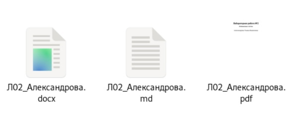

---
## Front matter
lang: ru-RU
title: Лабораторная работа №3
subtitle: Операционные системы
author:
  - Александрова У. В.
institute:
  - Российский университет дружбы народов, Москва, Россия
  - НКАбд-01-22
date: 23 февраля 2023

## i18n babel
babel-lang: russian
babel-otherlangs: english

## Formatting pdf
toc: false
toc-title: Содержание
slide_level: 2
aspectratio: 169
section-titles: true
theme: metropolis
header-includes:
 - \metroset{progressbar=frametitle,sectionpage=progressbar,numbering=fraction}
 - '\makeatletter'
 - '\beamer@ignorenonframefalse'
 - '\makeatother'
---

## Цель работы

Научиться оформлять отчёты с помощью легковесного языка разметки Markdown.

## Задачи

- Сделать отчёт по предыдущей лабораторной работе в формате Markdown.
- В качестве отчёта предоставить отчёты в 3 форматах: pdf, docx и md.

## Структура отчета

- титульный лист;
- реферат;
- введение;
- основную часть;
- заключение.

## Изучение шаблона отчета

{width=70%}

## Изменение отчета

{width=70%}

## Компилирование

{width=70%}

## Отчеты

{width=70%}

## Вывод

Я освоила язык разметки Markdown.

:::

