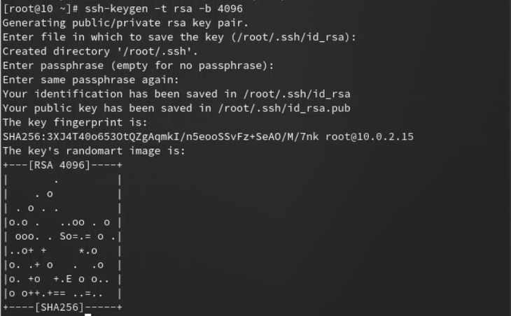

---
## Front matter
title: "Лабораторная работа №2"
subtitle: "Операционные системы"
author: "Александрова Ульяна Вадимовна"

## Generic otions
lang: ru-RU
toc-title: "Содержание"

## Bibliography
bibliography: bib/cite.bib
csl: pandoc/csl/gost-r-7-0-5-2008-numeric.csl

## Pdf output format
toc: true # Table of contents
toc-depth: 2
lof: true # List of figures
lot: true # List of tables
fontsize: 12pt
linestretch: 1.5
papersize: a4
documentclass: scrreprt
## I18n polyglossia
polyglossia-lang:
  name: russian
  options:
	- spelling=modern
	- babelshorthands=true
polyglossia-otherlangs:
  name: english
## I18n babel
babel-lang: russian
babel-otherlangs: english
## Fonts
mainfont: PT Serif
romanfont: PT Serif
sansfont: PT Sans
monofont: PT Mono
mainfontoptions: Ligatures=TeX
romanfontoptions: Ligatures=TeX
sansfontoptions: Ligatures=TeX,Scale=MatchLowercase
monofontoptions: Scale=MatchLowercase,Scale=0.9
## Biblatex
biblatex: true
biblio-style: "gost-numeric"
biblatexoptions:
  - parentracker=true
  - backend=biber
  - hyperref=auto
  - language=auto
  - autolang=other*
  - citestyle=gost-numeric
## Pandoc-crossref LaTeX customization
figureTitle: "Рис."
tableTitle: "Таблица"
listingTitle: "Листинг"
lofTitle: "Список иллюстраций"
lotTitle: "Список таблиц"
lolTitle: "Листинги"
## Misc options
indent: true
header-includes:
  - \usepackage{indentfirst}
  - \usepackage{float} # keep figures where there are in the text
  - \floatplacement{figure}{H} # keep figures where there are in the text
---

# Цель работы

Целью работы является изучение идеологии и применение средств контроля версий, а также освоение умения по работе с git.

# Задание

- Создать базовую конфигурацию для работы с git.
- Создать ключ SSH.
- Создать ключ PGP.
- Настроить подписи git.
- Зарегистрироваться на Github.
- Создать локальный каталог для выполнения заданий по предмету.

# Теоретическое введение

Системы контроля версий (Version Control System, VCS) применяются при работе нескольких человек над одним проектом. Обычно основное дерево проекта хранится в локальном или удалённом репозитории, к которому настроен доступ для участников проекта. При внесении изменений в содержание проекта система контроля версий позволяет их фиксировать, совмещать изменения, произведённые разными участниками проекта, производить откат к любой более ранней версии проекта, если это требуется.

Системы контроля версий поддерживают возможность отслеживания и разрешения конфликтов, которые могут возникнуть при работе нескольких человек над одним файлом. Можно объединить (слить) изменения, сделанные разными участниками (автоматически или вручную), вручную выбрать нужную версию, отменить изменения вовсе или заблокировать файлы для изменения. В зависимости от настроек блокировка не позволяет другим пользователям получить рабочую копию или препятствует изменению рабочей копии файла средствами файловой системы ОС, обеспечивая таким образом, привилегированный доступ только одному пользователю, работающему с файлом.

В табл. @tbl:std-dir приведены основные команды git.

: основные команды git {#tbl:std-dir}

| Команда      | Описание                                                                                                                   |
|--------------|----------------------------------------------------------------------------------------------------------------------------|
| `git init`   | Создание основного дерева репозитория                                                                                      |
| `git pull`   | Получение обновлений (изменений) текущего дерева из центрального репозитория                                               |
| `git push`   | Отправка всех произведённых изменений локального дерева в центральный репозиторий                                          |
| `git status` | Просмотр списка изменённых файлов в текущей директории                                                                     |
| `git diff`   | Просмотр текущих изменений                                                                                                 |
| `git add .`  | Добавить все изменённые и/или созданные файлы и/или каталоги                                                               |
| `git commit` | Сохранить добавленные изменения с внесением комментария через встроенный редактор                                          |
|`git checkout`| Создание новой ветки, базирующейся на текущей                                                                              |

# Выполнение лабораторной работы

Я установила git (рис. @fig:001).

{#fig:001 width=70%}

Далее установила gh (рис. @fig:002).

{#fig:002 width=70%}

Так как я уже осуществила базовую настройку git в прошлом семестре, то я сразу перехожу к созданию ключа ssh (рис. @fig:003).

{#fig:003 width=70%}

И импортирую его в свои настройки github (рис. @fig:004).

{#fig:004 width=70%}

Затем я создаю gpg ключ (рис. @fig:005).

{#fig:005 width=70%}

Копирую ключ через специальные утилиты (рис. @fig:006), (рис. @fig:007).

{#fig:006 width=70%}

{#fig:007 width=70%}

И экспортирую на сайт (рис. @fig:008).

{#fig:008 width=70%}

Я настроила автоматические подписи коммитов git (рис. @fig:009).

{#fig:009 width=70%}

Так как я уже работала с сервисом github, мне остается только создать репозиторий курса на основе шаблона (рис. @fig:010), (рис. @fig:011).

{#fig:010 width=70%}

{#fig:011 width=70%}

Далее я настраиваю каталог курса и отправлю файлы на сервер при помощи утилит *git add .*, *git commit -am 'feat(main): make course structure*, *git push* (рис. @fig:012).

{#fig:012 width=70%}

# Контрольные вопросы

1. Что такое системы контроля версий (VCS) и для решения каких задач они предназначаются?

Системы контроля версий (VCS) применяются при работе нескольких человек над одним проектом. Системы контроля версий поддерживают возможность отслеживания и разрешения конфликтов, которые могут возникнуть при работе нескольких человек над одним файлом. Можно объединить (слить) изменения, сделанные разными участниками (автоматически или вручную), вручную выбрать нужную версию, отменить изменения вовсе или заблокировать файлы для изменения.

2. Объясните следующие понятия VCS и их отношения: хранилище, commit, история, рабочая копия.

Хранилище - репозиторий, где хранится история изменений, а также док-ты, связанные с работой рабочего пространства.  
Commit - изменения, внесенные пользователями, работающими в одном пространстве.  
История - данные обо всех изменениях, внесенных в проект.  
Рабочая копия - последняя версия проекта.

3. Что представляют собой и чем отличаются централизованные и децентрализованные VCS? Приведите примеры VCS каждого вида.

Централизованные VCS - одно основное хранилище всего проекта. Каждый пользователь копирует себе необходимые ему файлы из этого репозитория, изменяет, затем добавляет изменения обратно в хранилище.  
Децентрализованные VCS - у каждого пользователя свой вариант репозитория, есть возможность добавлять и забирать изменения из любого репозитория. В отличие от классических, в децентралиованных системах контроля версий центральный репозиторий не является обязательным.

4. Опишите действия с VCS при единоличной работе с хранилищем.

Как и при совместной работе, создается репозиторий, куда по мере продвижения проекта отправляются изменения.

5. Опишите порядок работы с общим хранилищем VCS.

Пользователю предоставляется доступ к одной из версий проекта, которую он может редактировать и сохранять изменения, доступные другим участникам проекта.

6. Каковы основные задачи, решаемые инструментальным средством git?

Предоставление удобства работы нескольких человек над одним проектом.

7. Назовите и дайте краткую характеристику командам git.

| Команда      | Описание                                                                                                                   |
|--------------|----------------------------------------------------------------------------------------------------------------------------|
| `git init`   | Создание основного дерева репозитория                                                                                      |
| `git pull`   | Получение обновлений (изменений) текущего дерева из центрального репозитория                                               |
| `git push`   | Отправка всех произведённых изменений локального дерева в центральный репозиторий                                          |
| `git status` | Просмотр списка изменённых файлов в текущей директории                                                                     |
| `git diff`   | Просмотр текущих изменений                                                                                                 |
| `git add .`  | Добавить все изменённые и/или созданные файлы и/или каталоги                                                               |
| `git commit` | Сохранить добавленные изменения с внесением комментария через встроенный редактор                                          |
|`git checkout`| Создание новой ветки, базирующейся на текущей                                                                              |

10. Что такое и зачем могут быть нужны ветви (branches)?

Ветви нужны для того, чтобы программисты могли вести совместную работу над одним проектом вместе, но при этом не мешали друг другу.

# Выводы

Я изучила идеологию и применение средств контроля версий, а также освоение умения по работе с git.

::: {#refs}
:::
