---
## Front matter
title: "Лабораторная работа №5"
subtitle: "Операционные системы"
author: "Александрова Ульяна"

## Generic otions
lang: ru-RU
toc-title: "Содержание"

## Bibliography
bibliography: bib/cite.bib
csl: pandoc/csl/gost-r-7-0-5-2008-numeric.csl

## Pdf output format
toc: true # Table of contents
toc-depth: 2
lof: true # List of figures
lot: true # List of tables
fontsize: 12pt
linestretch: 1.5
papersize: a4
documentclass: scrreprt
## I18n polyglossia
polyglossia-lang:
  name: russian
  options:
	- spelling=modern
	- babelshorthands=true
polyglossia-otherlangs:
  name: english
## I18n babel
babel-lang: russian
babel-otherlangs: english
## Fonts
mainfont: PT Serif
romanfont: PT Serif
sansfont: PT Sans
monofont: PT Mono
mainfontoptions: Ligatures=TeX
romanfontoptions: Ligatures=TeX
sansfontoptions: Ligatures=TeX,Scale=MatchLowercase
monofontoptions: Scale=MatchLowercase,Scale=0.9
## Biblatex
biblatex: true
biblio-style: "gost-numeric"
biblatexoptions:
  - parentracker=true
  - backend=biber
  - hyperref=auto
  - language=auto
  - autolang=other*
  - citestyle=gost-numeric
## Pandoc-crossref LaTeX customization
figureTitle: "Рис."
tableTitle: "Таблица"
listingTitle: "Листинг"
lofTitle: "Список иллюстраций"
lotTitle: "Список таблиц"
lolTitle: "Листинги"
## Misc options
indent: true
header-includes:
  - \usepackage{indentfirst}
  - \usepackage{float} # keep figures where there are in the text
  - \floatplacement{figure}{H} # keep figures where there are in the text
---

# Цель работы

Целью работы является ознакомление с файловой системой Linux, её структурой, именами и содержанием каталогов. Приобретение практических навыков по применению команд для работы с файлами и каталогами, по управлению процессами (и работами), по проверке использования диска и обслуживанию файловой системы.

# Задание

1. Выполните все примеры, приведённые в первой части описания лабораторной работы.

2. Выполните следующие действия, зафиксировав в отчёте по лабораторной работе используемые при этом команды и результаты их выполнения:
2.1. Скопируйте файл /usr/include/sys/io.h в домашний каталог и назовите его equipment. Если файла io.h нет, то используйте любой другой файл в каталоге /usr/include/sys/ вместо него.  
2.2. В домашнем каталоге создайте директорию ~/ski.plases.  
2.3. Переместите файл equipment в каталог ~/ski.plases.  
2.4. Переименуйте файл ~/ski.plases/equipment в ~/ski.plases/equiplist.  
2.5. Создайте в домашнем каталоге файл abc1 и скопируйте его в каталог ~/ski.plases, назовите его equiplist2.  
2.6. Создайте каталог с именем equipment в каталоге ~/ski.plases.  
2.7. Переместите файлы ~/ski.plases/equiplist и equiplist2 в каталог ~/ski.plases/equipment.  
2.8. Создайте и переместите каталог ~/newdir в каталог ~/ski.plases и назовите его plans.  

3. Определите опции команды chmod, необходимые для того, чтобы присвоить перечисленным ниже файлам выделенные права доступа, считая, что в начале таких прав нет:  
3.1. drwxr--r-- ... australia  
3.2. drwx--x--x ... play  
3.3. -r-xr--r-- ... my_os  
3.4. -rw-rw-r-- ... feathers  
При необходимости создайте нужные файлы.  

4. Проделайте приведённые ниже упражнения, записывая в отчёт по лабораторной
работе используемые при этом команды:  
4.1. Просмотрите содержимое файла /etc/password.  
4.2. Скопируйте файл ~/feathers в файл ~/file.old.  
4.3. Переместите файл ~/file.old в каталог ~/play.  
4.4. Скопируйте каталог ~/play в каталог ~/fun.  
4.5. Переместите каталог ~/fun в каталог ~/play и назовите его games.  
4.6. Лишите владельца файла ~/feathers права на чтение.  
4.7. Что произойдёт, если вы попытаетесь просмотреть файл ~/feathers командой cat?  
4.8. Что произойдёт, если вы попытаетесь скопировать файл ~/feathers?  
4.9. Дайте владельцу файла ~/feathers право на чтение.  
4.10. Лишите владельца каталога ~/play права на выполнение.  
4.11. Перейдите в каталог ~/play. Что произошло?  
4.12. Дайте владельцу каталога ~/play право на выполнение.  

5. Прочитайте man по командам mount, fsck, mkfs, kill и кратко их охарактеризуйте, приведя примеры.

# Теоретическое введение

Каждый файл или каталог имеет права доступа.
В сведениях о файле или каталоге указываются:
– тип файла (символ (-) обозначает файл, а символ (d) — каталог);
– права для владельца файла (r — разрешено чтение, w — разрешена запись, x — разрешено выполнение, - — право доступа отсутствует);
– права для членов группы (r — разрешено чтение, w — разрешена запись, x — разрешено
выполнение, - — право доступа отсутствует);
– права для всех остальных (r — разрешено чтение, w — разрешена запись, x — разрешено
выполнение, - — право доступа отсутствует).

# Выполнение лабораторной работы

Я выполнила примеры из первой части описания лабораторной работы (рис. @fig:001), (рис. @fig:002), (рис. @fig:003).

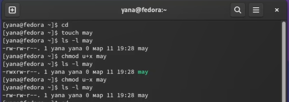{#fig:001 width=70%}

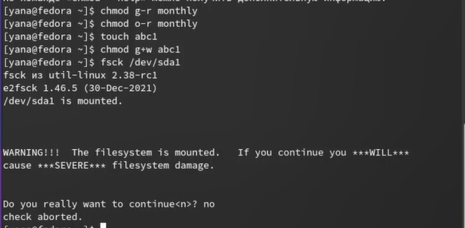{#fig:002 width=70%}

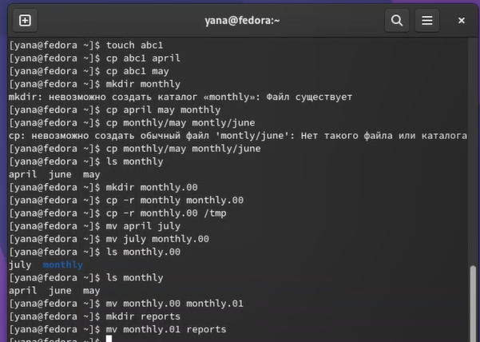{#fig:003 width=70%}

Скопировала файл /usr/include/sys/io.h в домашний каталог и назвала его equipment (рис. @fig:004).

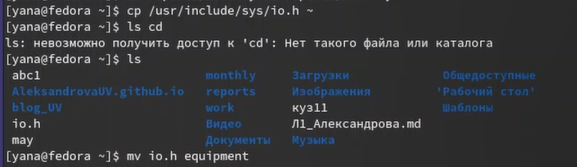{#fig:004 width=70%}

В домашнем каталоге создала директорию ~/ski.plases и переместила файл equipment в каталог ~/ski.plases (рис. @fig:005).

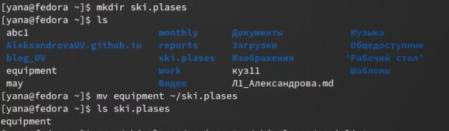{#fig:005 width=70%}

Переименовала файл ~/ski.plases/equipment в ~/ski.plases/equiplist и создала в домашнем каталоге файл abc1, скопировала его в каталог ~/ski.plases, назвала его equiplist2 (рис. @fig:006).

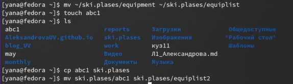{#fig:006 width=70%}

Создала каталог с именем equipment в каталоге ~/ski.plases (рис. @fig:007).

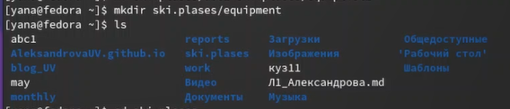{#fig:007 width=70%}

Переместила файлы ~/ski.plases/equiplist и equiplist2 в каталог ~/ski.plases/equipment (рис. @fig:008).

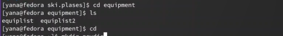{#fig:008 width=70%}

Создала и переместите каталог ~/newdir в каталог ~/ski.plases и назвала его plans (рис. @fig:009).

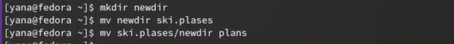{#fig:009 width=70%}

Определила опции команды chmod, необходимые для того, чтобы присвоить перечисленным ниже файлам выделенные права доступа, считая, что в начале таких прав нет (рис. @fig:010).

australia: u+x, g+r-w-x, o+r-w-x  
play: u+x, g-r-w+x, o-r-w+x  
my_os: u-w+x, g+r-w-x, o+r-w-x
feathers: g+r+w-x, o+r-w-x  

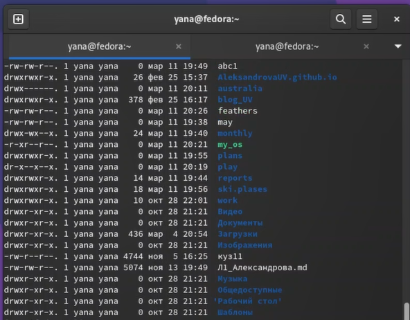{#fig:010 width=70%}

Я посмотрела содержимое файла /etc/passwd (рис. @fig:011).

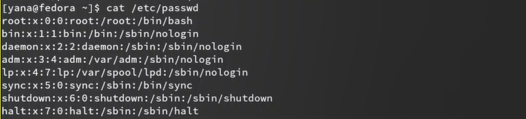{#fig:011 width=70%}

Скопировала файл ~/feathers в файл ~/file.old, переместила файл ~/file.old в каталог ~/play и скопировала каталог ~/play в каталог ~/fun (рис. @fig:012).

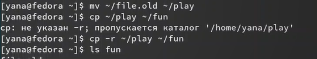{#fig:012 width=70%}

Я переместила каталог ~/fun в каталог ~/play и назовите его games и лишила владельца файла ~/feathers права на чтение (рис. @fig:013).

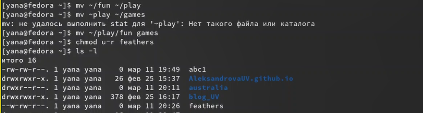{#fig:013 width=70%}

Мне отказано в доступе на чтение и копирование файла. Я вернула права на чтение владельцу файла ~/feathers и дала владельцу каталога ~/play право на выполнение (рис. @fig:014).

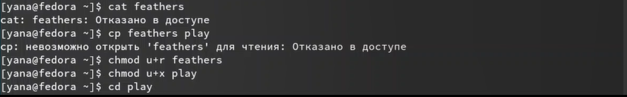{#fig:014 width=70%}

Прочитала man по командам mount, fsck, mkfs, kill (рис. @fig:015), (рис. @fig:016).

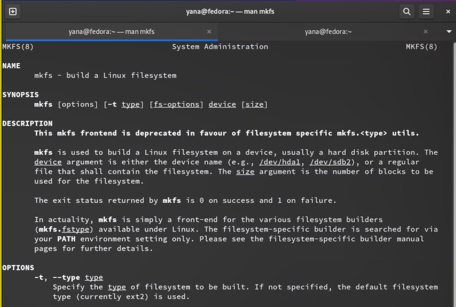{#fig:015 width=70%}

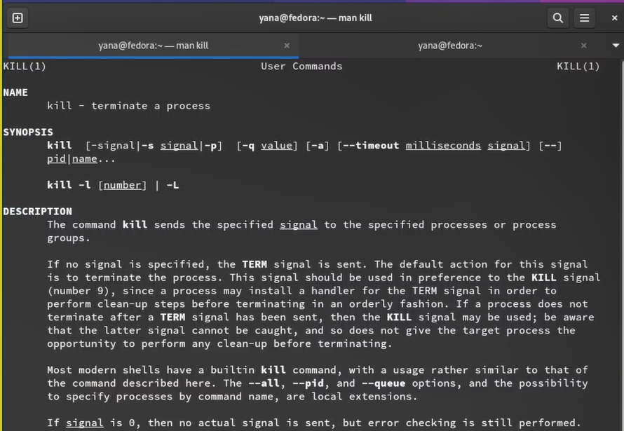{#fig:016 width=70%}

# Выводы

Я ознакомилась с файловой системой Linux, её структурой, именами и содержанием каталогов. Приобрела практические навыки по применению команд для работы с файлами и каталогами, по управлению процессами (и работами), по проверке использования диска и обслуживанию файловой системы.

# Контрольные вопросы

1. Дайте характеристику каждой файловой системе, существующей на жёстком диске компьютера, на котором вы выполняли лабораторную работу.

Ext (extended) FS. Это расширенная файловая система, одна из первых. Была запущена в работу еще в 1992 году. В основе ее функциональности лежала ФС UNIX. Основная задача состояла в выходе за рамки конфигурации классической файловой системы MINIX, исключить ее ограничения и повысить эффективность администрирования. Сегодня она применяется крайне редко.

Ext2. Вторая, более расширенная вервия ФС, паявшаяся на рынке в 1993 году. По своей структуре продукт аналогичный Ext. Изменения коснулись интерфейса, конфигурации. Увеличился объем памяти, производительность. Максимально допустимый объем файлов для хранения (указывается в настройках) – 2 ТБ. Ввиду невысокой перспективности применяется на практике редко.

Ext3. Третье поколение Extended FS, введенное в использование в 2001 году. Уже относится к журналируемой. Позволяет хранить логи – изменения, обновления файлов данных записываются в отдельный журнал еще до того, как эти действия будут завершены. После перезагрузки ПК, такая ФС позволит восстановить файлы благодаря внедрению в систему специального алгоритма.

Ext4. Четвертое поколение Extended FS, запущенное в 2006 году. Здесь максимально убраны всевозможные ограничения, присутствующие в предыдущих версиях. Сегодня именно она по умолчанию входит в состав большей части дистрибутивов Линукс. Передовой ее нельзя назвать, но стабильность и надежность работы здесь в приоритете. В Unix системах применяется повсеместно.

2. Приведите общую структуру файловой системы и дайте характеристику каждой директории первого уровня этой структуры.

/ — root каталог. Содержит в себе всю иерархию системы;

/bin — здесь находятся двоичные исполняемые файлы. Основные общие команды, хранящиеся отдельно от других программ в системе (прим.: pwd, ls, cat, ps);

/boot — тут расположены файлы, используемые для загрузки системы (образ initrd, ядро vmlinuz);

/dev — в данной директории располагаются файлы устройств (драйверов). С помощью этих файлов можно взаимодействовать с устройствами. К примеру, если это жесткий диск, можно подключить его к файловой системе. В файл принтера же можно написать напрямую и отправить задание на печать;

/etc — в этой директории находятся файлы конфигураций программ. Эти файлы позволяют настраивать системы, сервисы, скрипты системных демонов;

/home — каталог, аналогичный каталогу Users в Windows. Содержит домашние каталоги учетных записей пользователей (кроме root). При создании нового пользователя здесь создается одноименный каталог с аналогичным именем и хранит личные файлы этого пользователя;

/lib — содержит системные библиотеки, с которыми работают программы и модули ядра;

/lost+found — содержит файлы, восстановленные после сбоя работы системы. Система проведет проверку после сбоя и найденные файлы можно будет посмотреть в данном каталоге;

/media — точка монтирования внешних носителей. Например, когда вы вставляете диск в дисковод, он будет автоматически смонтирован в директорию /media/cdrom;

/mnt — точка временного монтирования. Файловые системы подключаемых устройств обычно монтируются в этот каталог для временного использования;

/opt — тут расположены дополнительные (необязательные) приложения. Такие программы обычно не подчиняются принятой иерархии и хранят свои файлы в одном подкаталоге (бинарные, библиотеки, конфигурации);

3. Какая операция должна быть выполнена, чтобы содержимое некоторой файловой системы было доступно операционной системе?

Монтриование тома.

4. Назовите основные причины нарушения целостности файловой системы. Как устранить повреждения файловой системы?

Отсутствие синхронизации между образом файловой системы в памяти и ее данными на диске в случае аварийного останова может привести к появлению следующих ошибок:

Один блок адресуется несколькими mode (принадлежит нескольким файлам).  
Блок помечен как свободный, но в то же время занят (на него ссылается onode).  
Блок помечен как занятый, но в то же время свободен (ни один inode на него не ссылается).  
Неправильное число ссылок в inode (недостаток или избыток ссылающихся записей в каталогах).  
Несовпадение между размером файла и суммарным размером адресуемых inode блоков.  
Недопустимые адресуемые блоки (например, расположенные за пределами файловой системы).  
"Потерянные" файлы (правильные inode, на которые не ссылаются записи каталогов).  
Недопустимые или неразмещенные номера inode в записях каталогов.  

5. Как создаётся файловая система?

mkfs - позволяет создать файловую систему Linux.

6. Дайте характеристику командам для просмотра текстовых файлов.

Cat - выводит содержимое файла на стандартное устройство вывода. Выполнение команды head выведет первые 10 строк текстового файла. Выполнение команды tail выведет последние 10 строк текстового файла.  
Команда tac - это тоже самое, что и cat, только отображает строки в обратном порядке. Для того, чтобы просмотреть огромный текстовый файл применяются команды для постраничного просмотра. Такие как more и less.

7. Приведите основные возможности команды cp в Linux.

Копирование, перемещение файлов и директорий.

8. Приведите основные возможности команды mv в Linux.

Перемещение и переименовавывание файлов или директорий.

9. Что такое права доступа? Как они могут быть изменены?

Права доступа к файлу или каталогу можно изменить, воспользовавшись командой chmod. Сделать это может владелец файла (или каталога) или пользователь с правами администратора.

::: {#refs}
:::
