---
## Front matter
lang: ru-RU
title: Лабораторная работа №7
subtitle: Операционные системы
author:
  - Александрова Ульяна
institute:
  - Российский университет дружбы народов, Москва, Россия
date: 25 марта 2023

## i18n babel
babel-lang: russian
babel-otherlangs: english

## Formatting pdf
toc: false
toc-title: Содержание
slide_level: 2
aspectratio: 169
section-titles: true
theme: metropolis
header-includes:
 - \metroset{progressbar=frametitle,sectionpage=progressbar,numbering=fraction}
 - '\makeatletter'
 - '\beamer@ignorenonframefalse'
 - '\makeatother'
---

# Докладчик

:::::::::::::: {.columns align=center}
::: {.column width="70%"}

  * Александрова Ульяна
  * Студент группы НКАбд-01-22
  * Кафедра прикладной информатики и теории вероятностей
  * Российский университет дружбы народов
  * [1132226444@pfur.ru](mailto:11322264440@pfur.ru)
  * <https://github.com/AleksandrovaUV>

## Цель работы

Освоение основных возможностей командной оболочки Midnight Commander. Приобретение навыков практической работы по просмотру каталогов и файлов; манипуляций с ними.

## Задание

1. Создайте текстовой файл text.txt.
2. Откройте этот файл с помощью встроенного в mc редактора.
3. Вставьте в открытый файл небольшой фрагмент текста, скопированный из любого
другого файла или Интернета.
4. Проделайте с текстом следующие манипуляции, используя горячие клавиши:  
4.1. Удалите строку текста.  
4.2. Выделите фрагмент текста и скопируйте его на новую строку.  
4.3. Выделите фрагмент текста и перенесите его на новую строку.  
4.4. Сохраните файл.  
4.5. Отмените последнее действие.  
4.6. Перейдите в конец файла (нажав комбинацию клавиш) и напишите некоторый текст.  
4.7. Перейдите в начало файла (нажав комбинацию клавиш) и напишите некоторый текст.  
4.8. Сохраните и закройте файл.
5. Откройте файл с исходным текстом на некотором языке программирования (например C или Java)
6. Используя меню редактора, включите подсветку синтаксиса, если она не включена, или выключите, если она включена.

# Теоретическое введение

## Midnight Commander

Командная оболочка — интерфейс взаимодействия пользователя с операционной системой и программным обеспечением посредством команд.

Midnight Commander (или mc) — псевдографическая командная оболочка для UNIX/Linux систем. Для запуска mc необходимо в командной строке набрать mc и нажать Enter.

# Выполнение лабораторной работы

## Выполнение

Я изучила информацию о mc, вызвав в командной строке man mc.

{#fig:001 width=70%}

## Выполнение

Я запустила mc и изучила его структуру, а также выполнила несколько операций с помощью горячих клавиш. Я вывела информацию о файлах, которая была достаточно исчерпывающая.

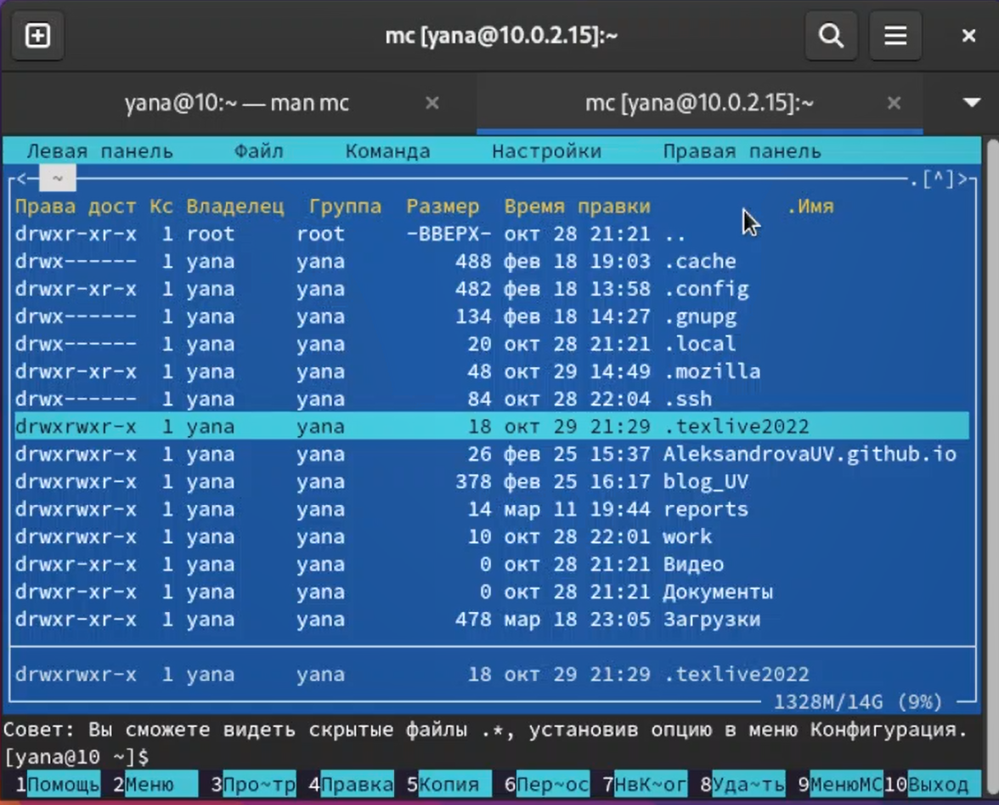{#fig:002 width=70%}

## Выполнение

Используя подменю Файл, просмотрела содержимое текстового файла.

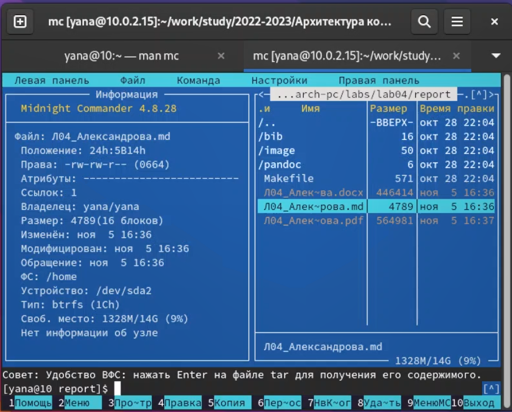{#fig:003 width=70%}

## Выполнение

Создала каталог и скопировала туда файлы.

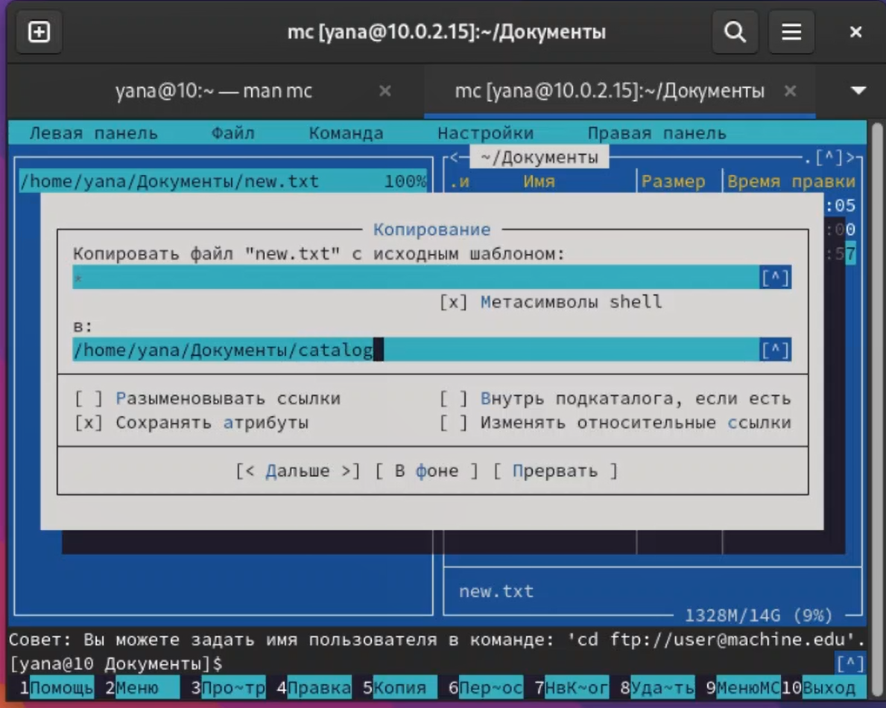{#fig:005 width=70%}

## Выполнение

Используя подменю Команда, я осуществила поиск в файловой системе с заданными условиями.

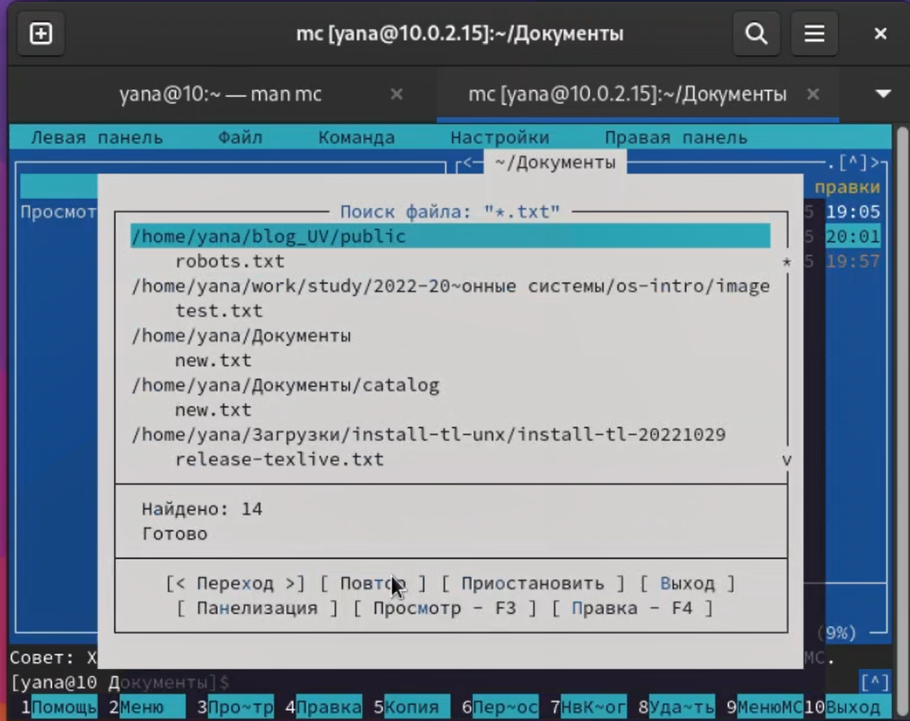{#fig:006 width=70%}

## Выполнение

Я выбрала и повторила предыдущую команду.

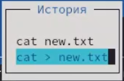{#fig:007 width=70%}

## Выполнение

А также проанализировала файла меню и расширений.

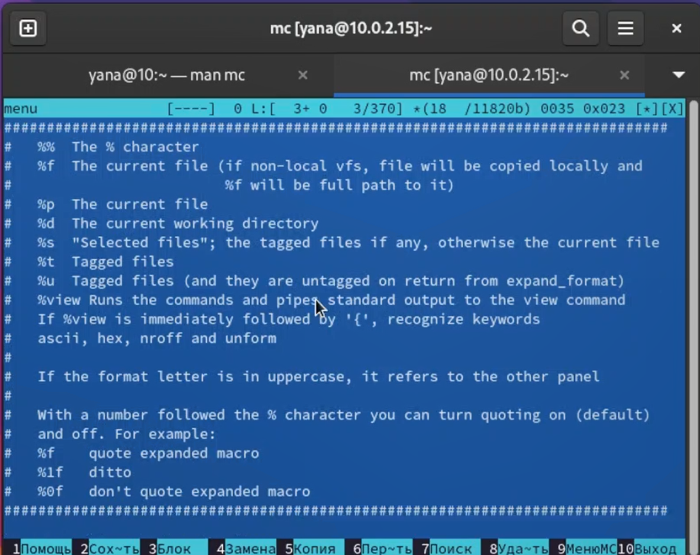{#fig:008 width=70%}

## Выполнение

Используя подменю Настройки, освоила операции, определяющие структуру экрана mc.

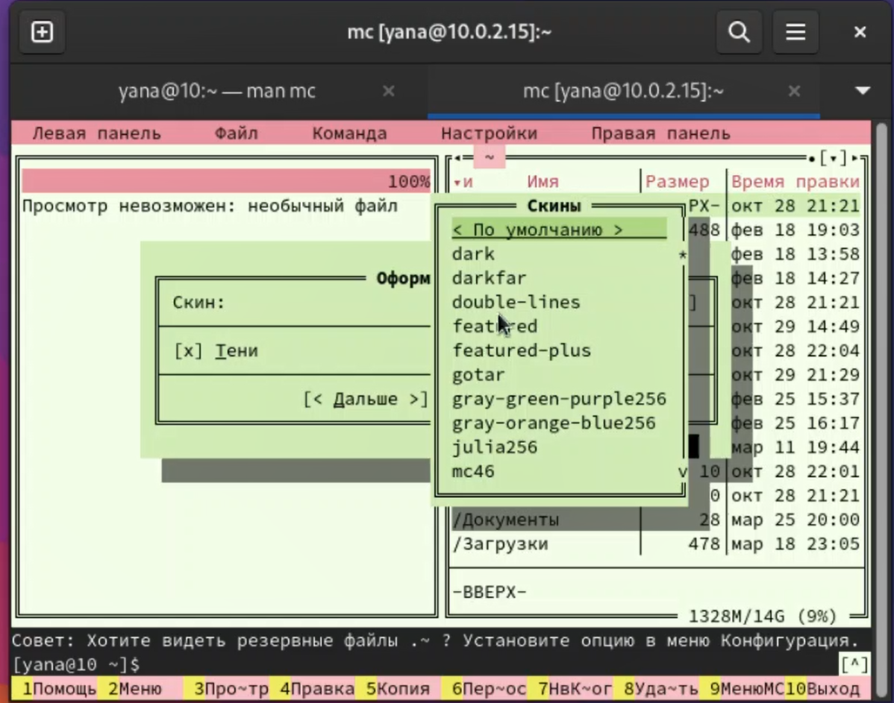{#fig:009 width=70%}

## Выполнение

Создала текстовой файл text.txt, открыла его с помощью встроенного в mc редактора и вставила в открытый файл небольшой фрагмент текста.

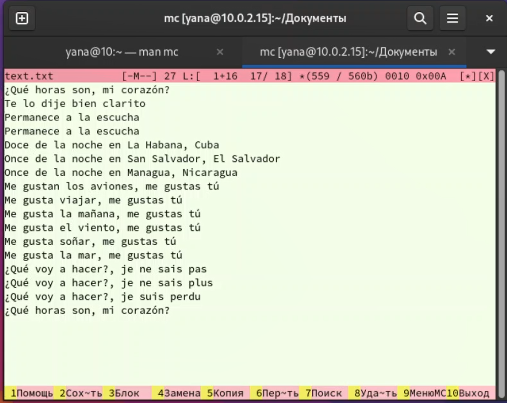{#fig:010 width=70%}

## Выполнение

Проделала с текстом следующие манипуляции, используя горячие клавиши: удаление строки текста, выделение фрагмента текста и его последующие копирование и перемещение, сохранение файла, отмена последнего действия, переход в конец и начало файла.

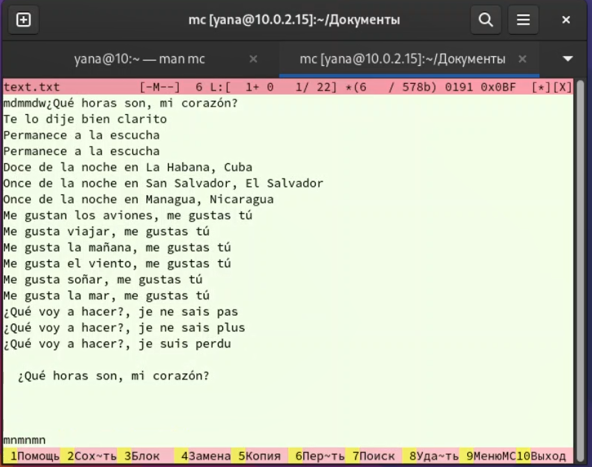{#fig:011 width=70%}

## Выполнение

Открыла файл с исходным текстом на языке C.

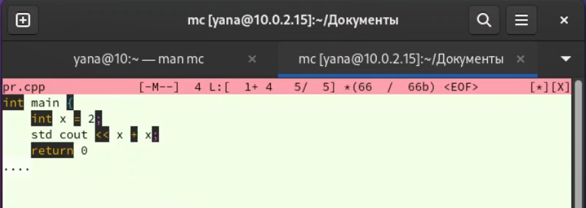{#fig:012 width=70%}

## Выполнение

Используя меню редактора, выключила подсветку синтаксиса.

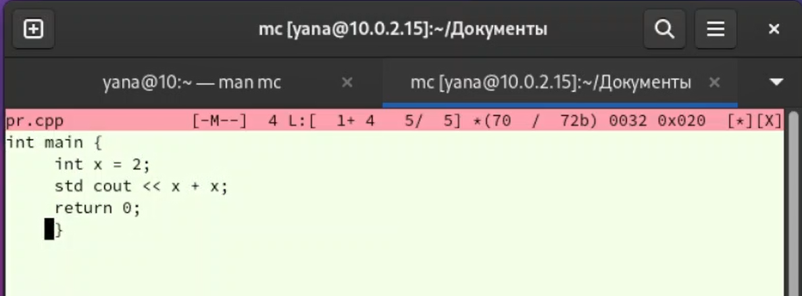{#fig:013 width=70%}

