---
## Front matter
title: "Лабораторная работа №7"
subtitle: "Операционные системы"
author: "Александрова Ульяна"

## Generic otions
lang: ru-RU
toc-title: "Содержание"

## Bibliography
bibliography: bib/cite.bib
csl: pandoc/csl/gost-r-7-0-5-2008-numeric.csl

## Pdf output format
toc: true # Table of contents
toc-depth: 2
lof: true # List of figures
lot: true # List of tables
fontsize: 12pt
linestretch: 1.5
papersize: a4
documentclass: scrreprt
## I18n polyglossia
polyglossia-lang:
  name: russian
  options:
	- spelling=modern
	- babelshorthands=true
polyglossia-otherlangs:
  name: english
## I18n babel
babel-lang: russian
babel-otherlangs: english
## Fonts
mainfont: PT Serif
romanfont: PT Serif
sansfont: PT Sans
monofont: PT Mono
mainfontoptions: Ligatures=TeX
romanfontoptions: Ligatures=TeX
sansfontoptions: Ligatures=TeX,Scale=MatchLowercase
monofontoptions: Scale=MatchLowercase,Scale=0.9
## Biblatex
biblatex: true
biblio-style: "gost-numeric"
biblatexoptions:
  - parentracker=true
  - backend=biber
  - hyperref=auto
  - language=auto
  - autolang=other*
  - citestyle=gost-numeric
## Pandoc-crossref LaTeX customization
figureTitle: "Рис."
tableTitle: "Таблица"
listingTitle: "Листинг"
lofTitle: "Список иллюстраций"
lotTitle: "Список таблиц"
lolTitle: "Листинги"
## Misc options
indent: true
header-includes:
  - \usepackage{indentfirst}
  - \usepackage{float} # keep figures where there are in the text
  - \floatplacement{figure}{H} # keep figures where there are in the text
---

# Цель работы

Освоение основных возможностей командной оболочки Midnight Commander. Приобретение навыков практической работы по просмотру каталогов и файлов; манипуляций с ними.

# Задание

1. Создайте текстовой файл text.txt.
2. Откройте этот файл с помощью встроенного в mc редактора.
3. Вставьте в открытый файл небольшой фрагмент текста, скопированный из любого
другого файла или Интернета.
4. Проделайте с текстом следующие манипуляции, используя горячие клавиши:  
4.1. Удалите строку текста.  
4.2. Выделите фрагмент текста и скопируйте его на новую строку.  
4.3. Выделите фрагмент текста и перенесите его на новую строку.  
4.4. Сохраните файл.  
4.5. Отмените последнее действие.  
4.6. Перейдите в конец файла (нажав комбинацию клавиш) и напишите некоторый текст.  
4.7. Перейдите в начало файла (нажав комбинацию клавиш) и напишите некоторый текст.  
4.8. Сохраните и закройте файл.
5. Откройте файл с исходным текстом на некотором языке программирования (например C или Java)
6. Используя меню редактора, включите подсветку синтаксиса, если она не включена, или выключите, если она включена.

# Теоретическое введение

Командная оболочка — интерфейс взаимодействия пользователя с операционной системой и программным обеспечением посредством команд.

Midnight Commander (или mc) — псевдографическая командная оболочка для UNIX/Linux систем. Для запуска mc необходимо в командной строке набрать mc и нажать Enter.

Рабочее пространство mc имеет две панели, отображающие по умолчанию списки файлов двух каталогов. Над панелями располагается меню, доступ к которому осуществляется с помощью клавиши F9 . Под панелями внизу расположены управляющие экранные кнопки, ассоциированные с функциональными клавишами F1 – F10 (табл. 7.1). Над ними располагается командная строка, предназначенная для ввода команд.

F1 - Вызов контекстно-зависимой подсказки  
F2 - Вызов пользовательского меню с возможностью создания и/или дополнения дополнительных функций  
F3 - Просмотр содержимого файла, на который указывает подсветка в активной панели (без возможности редактирования)  
F4 - Вызов встроенного в mc редактора для изменения содержания файла, на который указывает подсветка в активной панели  
F5 - Копирование одного или нескольких файлов, отмеченных в первой (активной) панели, в каталог, отображаемый на второй панели  
F6 - Перенос одного или нескольких файлов, отмеченных в первой (активной) панели, в каталог, отображаемый на второй панели  
F7 - Создание подкаталога в каталоге, отображаемом в активной панели  
F8 - Удаление одного или нескольких файлов (каталогов), отмеченных в первой (активной) панели файлов  
F9 - Вызов меню mc  
F10 - Выход из mc

Панель в mc отображает список файлов текущего каталога. Абсолютный путь к этому каталогу отображается в заголовке панели. У активной панели заголовок и одна из её строк подсвечиваются. Управление панелями осуществляется с помощью определённых комбинаций клавиш или пунктов меню mc. Панели можно поменять местами. Для этого и используется комбинация клавиш Ctrl-u или команда меню mc Переставить панели.  
Также можно временно убрать отображение панелей (отключить их) с помощью комбинации клавиш Ctrl-o или команды меню mc Отключить панели . Это может быть полезно, например, если необходимо увидеть вывод какой-то информации на экран после выполнения какой-либо команды shell. С помощью последовательного применения комбинации клавиш Ctrl-x d есть возможность сравнения каталогов, отображённых на двух панелях. Панели могут дополнительно быть переведены в один из двух режимов: Информация или Дерево . В режиме Информация на панель выводятся сведения о файле и текущей файловой системе, расположенных на активной панели. В режиме Дерево на одной из панелей выводится структура дерева каталогов. Управлять режимами отображения панелей можно через пункты меню mc Правая панель и Левая панель.

# Выполнение лабораторной работы

Я изучила информацию о mc, вызвав в командной строке man mc (рис. @fig:001).

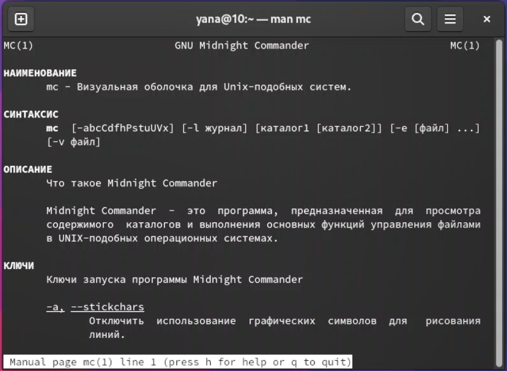{#fig:001 width=70%}

Я запустила mc и изучила его структуру, а также выполнила несколько операций с помощью горячих клавиш. Я вывела информацию о файлах, которая была достаточно исчерпывающая (рис. @fig:002).

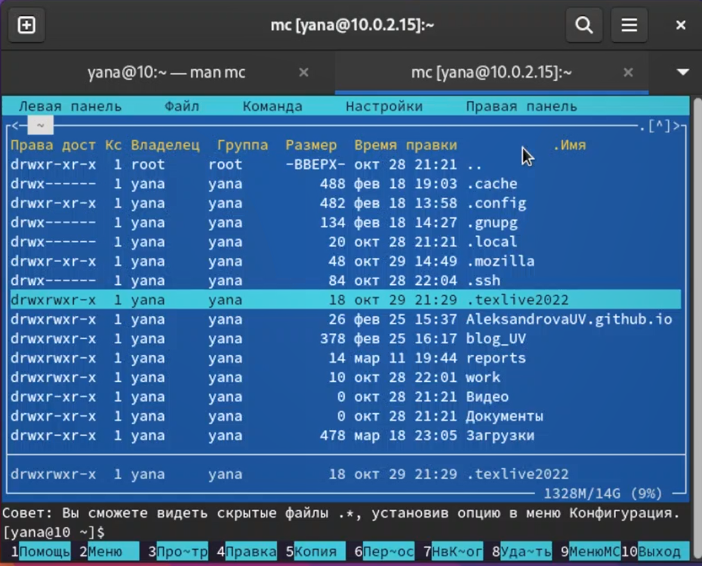{#fig:002 width=70%}

Используя подменю Файл, просмотрела содержимое текстового файла (рис. @fig:003).

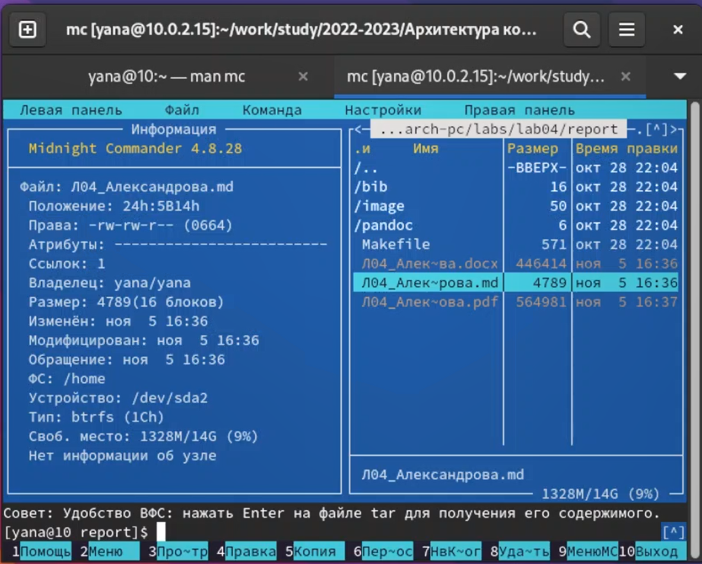{#fig:003 width=70%}

Создала каталог и скопировала туда файлы (рис. @fig:004) (рис. @fig:005).

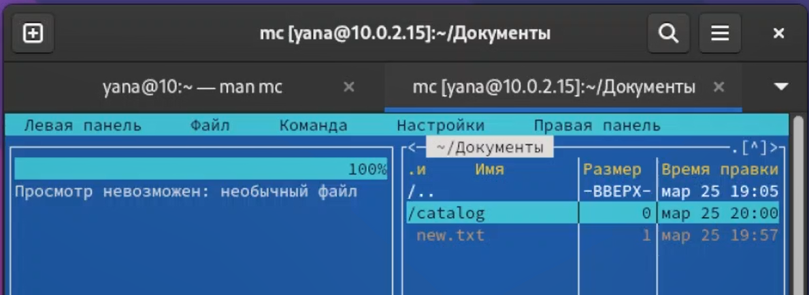{#fig:004 width=70%}

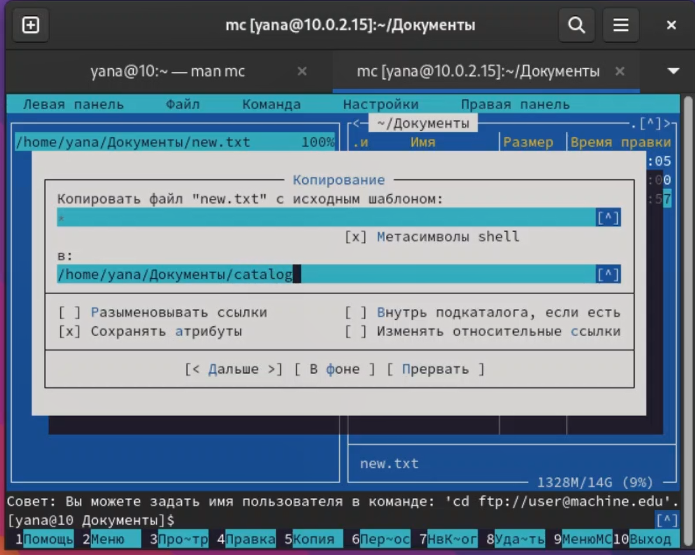{#fig:005 width=70%}

Используя подменю Команда, я осуществила поиск в файловой системе с заданными условиями (рис. @fig:006).

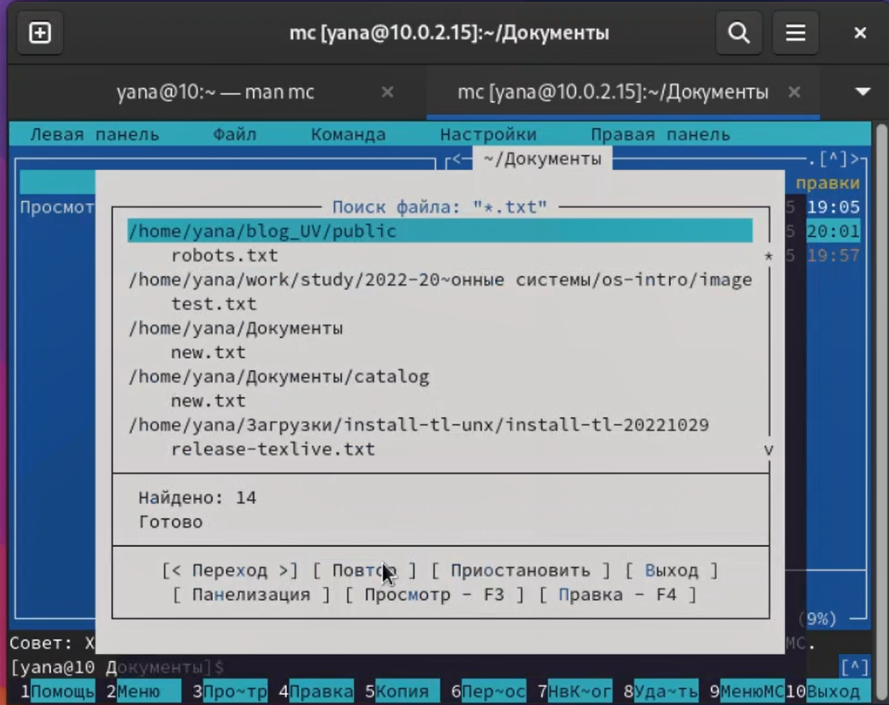{#fig:006 width=70%}

Я выбрала и повторила предыдущую команду (рис. @fig:007).

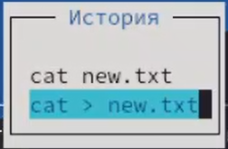{#fig:007 width=70%}

А также проанализировала файла меню и расширений  (рис. @fig:008).

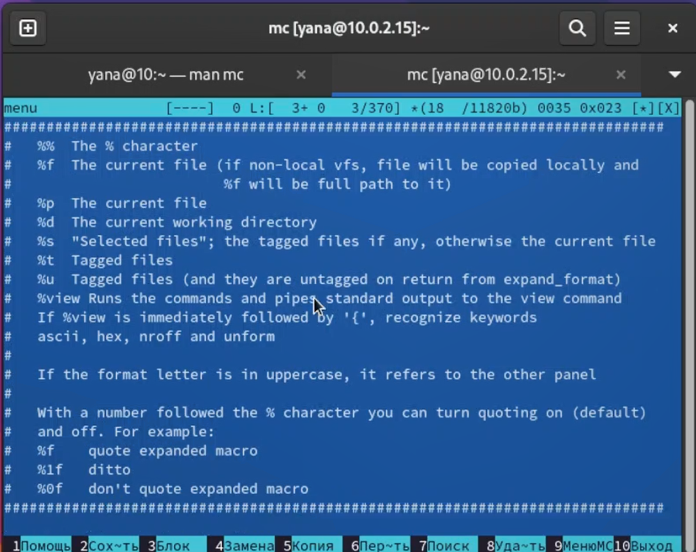{#fig:008 width=70%}

Используя подменю Настройки, освоила операции, определяющие структуру экрана mc (рис. @fig:009).

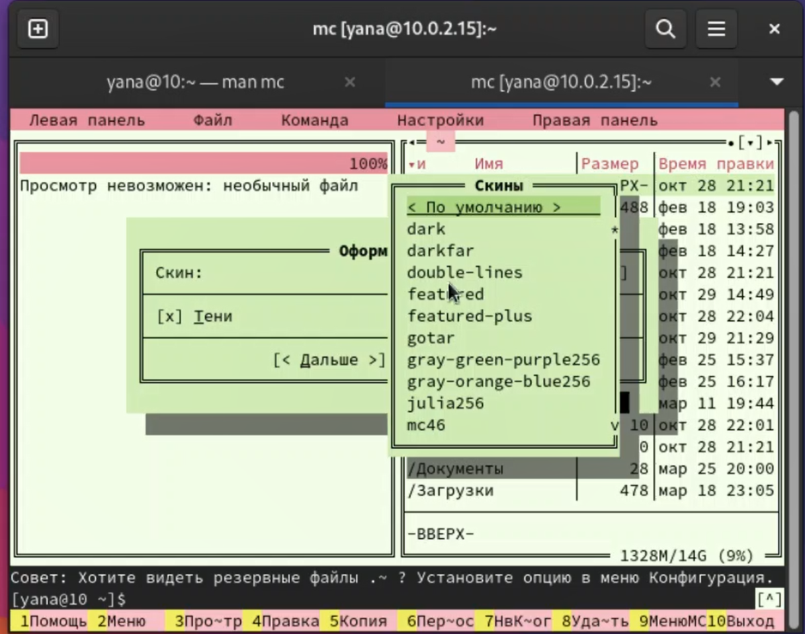{#fig:009 width=70%}

Создала текстовой файл text.txt, открыла его с помощью встроенного в mc редактора и вставила в открытый файл небольшой фрагмент текста (рис. @fig:010).

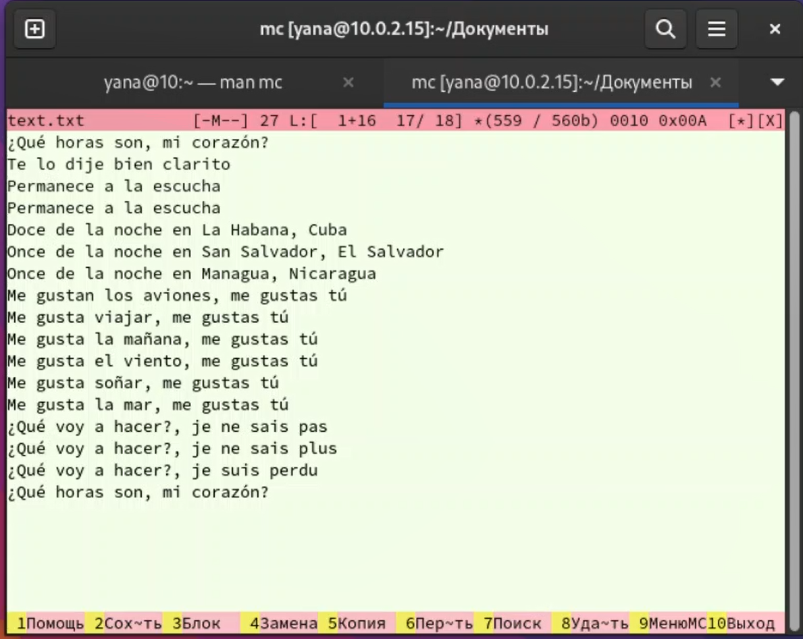{#fig:010 width=70%}

Проделала с текстом следующие манипуляции, используя горячие клавиши: удаление строки текста, выделение фрагмента текста и его последующие копирование и перемещение, сохранение файла, отмена последнего действия, переход в конец и начало файла (рис. @fig:011).

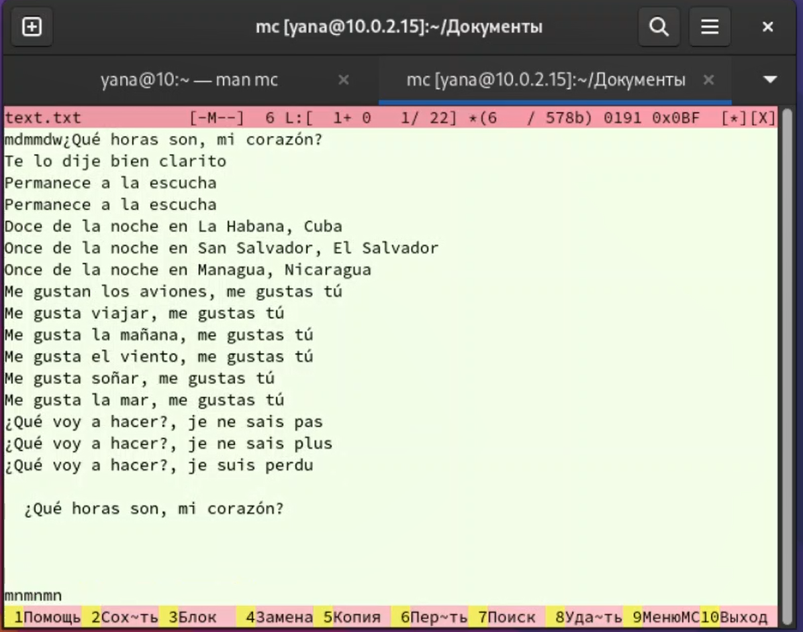{#fig:011 width=70%}

Открыла файл с исходным текстом на языке C (рис. @fig:012).

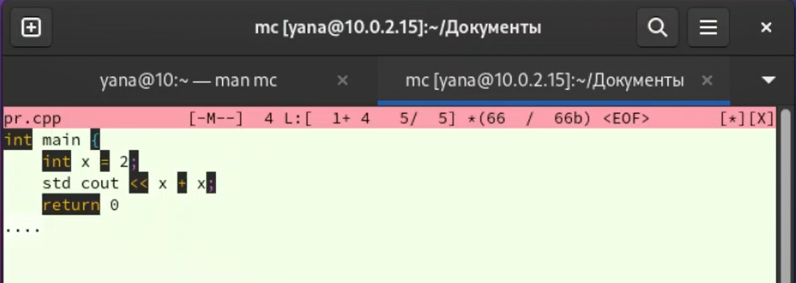{#fig:012 width=70%}

Используя меню редактора, выключила подсветку синтаксиса (рис. @fig:013).

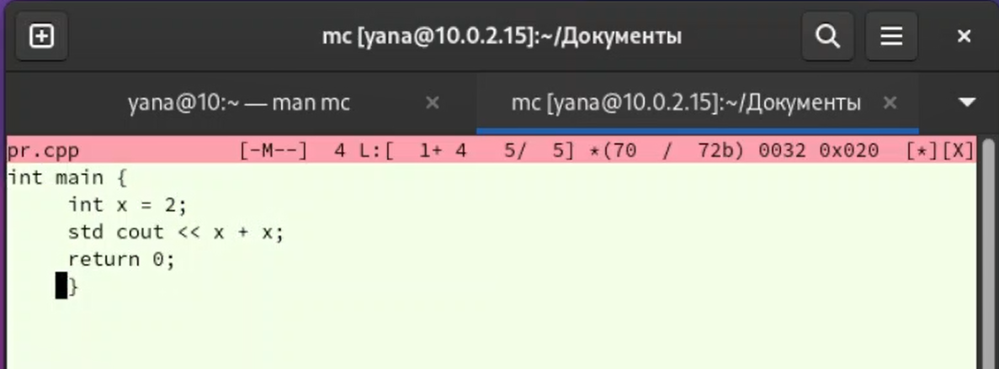{#fig:013 width=70%}

# Контрольные вопросы

1. Какие режимы работы есть в mc. Охарактеризуйте их.  
*Панели могут дополнительно быть переведены в один из двух режимов: Информация или Дерево. В режиме Информация на панель выводятся сведения о файле и текущей файловой системе, расположенных на активной панели.*  
2. Какие операции с файлами можно выполнить как с помощью команд shell, так и с помощью меню (комбинаций клавиш) mc? Приведите несколько примеров.  
*Команды почти идентичны: просмотр и редактирование файлов, удаление, копирование, перемещение и тд.*  
3. Опишите структура меню левой (или правой) панели mc, дайте характеристику командам.  
*В меню каждой (левой или правой) панели можно выбрать Формат списка:*  
*- стандартный — выводит список файлов и каталогов с указанием размера и времени правки;*  
*- ускоренный — позволяет задать число столбцов, на которые разбивается панель при выводе списка имён файлов или каталогов без дополнительной информации;*  
*- расширенный — помимо названия файла или каталога выводит сведения о правах доступа, владельце, группе, размере, времени правки;*  
*- определённый пользователем — позволяет вывести те сведения о файле или каталоге, которые задаст сам пользователь.*  
4. Опишите структура меню Файл mc, дайте характеристику командам.  
*В меню Файл содержит перечень команд, которые могут быть применены к одному или нескольким файлам или каталогам.*  
5. Опишите структура меню Команда mc, дайте характеристику командам.
*В меню Команда содержатся более общие команды для работы с mc.*  
*Команды меню Команда :*  
*Дерево каталогов — отображает структуру каталогов системы.*  
*Поиск файла — выполняет поиск файлов по заданным параметрам.*  
*Переставить панели — меняет местами левую и правую панели.*  
*Сравнить каталоги ( Ctrl-x d ) — сравнивает содержимое двух каталогов.*  
*Размеры каталогов — отображает размер и время изменения каталога (по умолчанию в mc размер - каталога корректно не отображается).*  
*История командной строки — выводит на экран список ранее выполненных в оболочке команд.*  
*Каталоги быстрого доступа ( Ctrl-\ ) — пр вызове выполняется быстрая смена текущего каталога на один из заданного списка.*  
*Восстановление файлов — позволяет восстановить файлы на файловых системах ext2 и ext3.*  
*Редактировать файл расширений — позволяет задать с помощью определённого синтаксиса действия при запуске файлов с определённым расширением (например, какое программного обеспечение запускать для открытия или редактирования файлов с расширением doc или docx).*  
*Редактировать файл меню — позволяет отредактировать контекстное меню пользователя, вызываемое по клавише F2 .*  
*Редактировать файл расцветки имён — позволяет подобрать оптимальную для пользователя расцветку имён файлов в зависимости от их типа.*  
6. Опишите структура меню Настройки mc, дайте характеристику командам.
*Меню Настройки содержит ряд дополнительных опций по внешнему виду и функциональности mc. Меню Настройки содержит:*  
*Конфигурация — позволяет скорректировать настройки работы с панелями.*  
*Внешний вид и Настройки панелей — определяет элементы (строка меню, командная строка, подсказки и прочее), отображаемые при вызове mc, а также геометрию расположения панелей и цветовыделение.*  
*Биты символов — задаёт формат обработки информации локальным терминалом.*  
*Подтверждение — позволяет установить или убрать вывод окна с запросом подтверждения действий при операциях удаления и перезаписи файлов, а также при выходе из программы.*  
*Распознание клавиш — диалоговое окно используется для тестирования функциональных клавиш, клавиш управления курсором и прочее.*  
*Виртуальные ФС –– настройки виртуальной файловой системы: тайм-аут, пароль и прочее.*  
7. Назовите и дайте характеристику встроенным командам mc.
*F1 - Вызов контекстно-зависимой подсказки*  
*F2 - Вызов пользовательского меню с возможностью создания и/или дополнения дополнительных функций*  
*F3 - Просмотр содержимого файла, на который указывает подсветка в активной панели (без возможности редактирования)*  
*F4 - Вызов встроенного в mc редактора для изменения содержания файла, на который указывает подсветка в активной панели*  
*F5 - Копирование одного или нескольких файлов, отмеченных в первой (активной) панели, в каталог, отображаемый на второй панели*  
*F6 - Перенос одного или нескольких файлов, отмеченных в первой (активной) панели, в каталог, отображаемый на второй панели*  
*F7 - Создание подкаталога в каталоге, отображаемом в активной панели*  
*F8 - Удаление одного или нескольких файлов (каталогов), отмеченных в первой (активной) панели файлов*  
*F9 - Вызов меню mc*  
*F10 - Выход из mc*
8. Назовите и дайте характеристику командам встроенного редактора mc.  
*Ctrl-y удалить строку;*  
*Ctrl-u отмена последней операции; Ins вставка/замена;*  
*F7 поиск (можно использовать регулярные выражения);*  
*(стрелочка вверх)-F7 повтор последней операции поиска;*  
*F4 замена;*  
*F3 первое нажатие — начало выделения, второе — окончание выделения;*  
*F5 копировать выделенный фрагмент;*  
*F6 переместить выделенный фрагмент;*  
*F8 удалить выделенный фрагмент;*  
*F2 записать изменения в файл;*  
*F10 выйти из редактора.*  
9. Дайте характеристику средствам mc, которые позволяют создавать меню, определяемые пользователем.  
*Можете сохранить часто используемые команды панелизации под отдельными информативными именами, чтобы иметь возможность их быстро вызвать по этим именам. Для этого нужно набрать команду в строке ввода (строка "Команда") и нажать кнопку Добавить. После этого потребуется ввести имя, по которому мы будем вызывать команду. В следующий раз вам достаточно будет выбрать нужное имя из списка, а не вводить всю команду заново.*
10. Дайте характеристику средствам mc, которые позволяют выполнять действия, определяемые пользователем, над текущим файлом.  
*Панель в mc отображает список файлов текущего каталога. Абсолютный путь к этому каталогу отображается в заголовке панели. У активной панели заголовок и одна из её строк подсвечиваются. Управление панелями осуществляется с помощью определённых комбинаций клавиш или пунктов меню mc.*

# Выводы

Я освоила основные возможности командной оболочки Midnight Commander и приобрела навыки практической работы по просмотру каталогов и файлов; манипуляций с ними.

# Список литературы{.unnumbered}

::: {#refs}
:::
