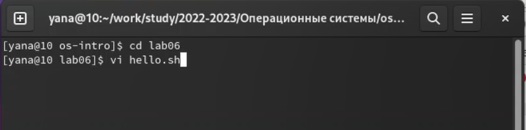
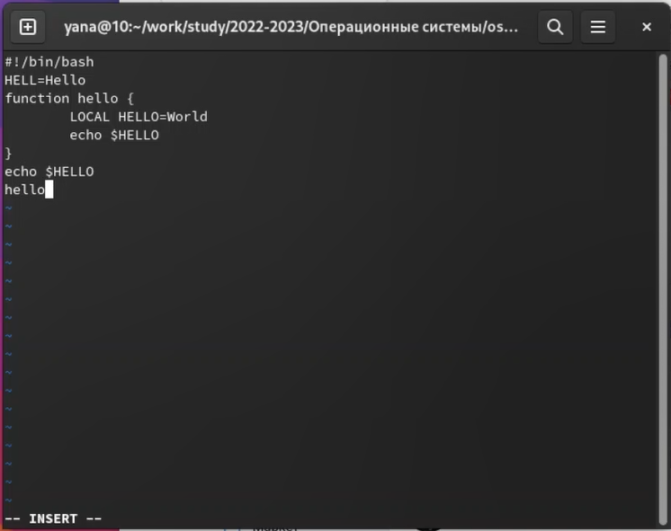
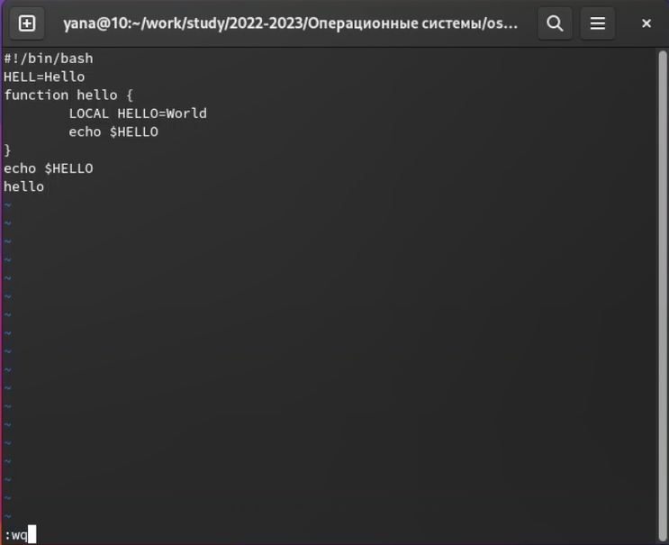
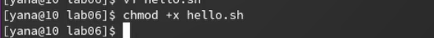
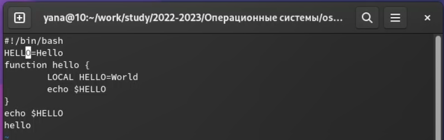
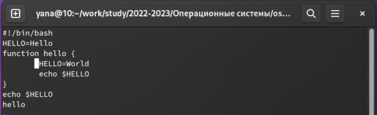
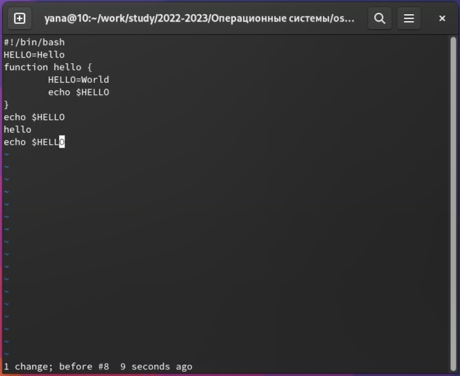

---
## Front matter
lang: ru-RU
title: Лабораторная работа №8
subtitle: Операционные системы
author:
  - Александрова Ульяна
institute:
  - Российский университет дружбы народов, Москва, Россия
date: 1 апреля 2023

## i18n babel
babel-lang: russian
babel-otherlangs: english

## Formatting pdf
toc: false
toc-title: Содержание
slide_level: 2
aspectratio: 169
section-titles: true
theme: metropolis
header-includes:
 - \metroset{progressbar=frametitle,sectionpage=progressbar,numbering=fraction}
 - '\makeatletter'
 - '\beamer@ignorenonframefalse'
 - '\makeatother'
---

# Информация

## Докладчик

  * Александрова Ульяна
  * Студентка 1го курса
  * Российский университет дружбы народов
  * <https://github.com/AleksandrovaUV>

# Цель работы

## Цель

Целью работы является ознакомление с операционной системой Linux и получение практических навыки работы с редактором vi, установленным по умолчанию практически во всех дистрибутивах.

# Задание

## Задание

1. Ознакомиться с теоретическим материалом.
2. Ознакомиться с редактором vi.
3. Выполнить упражнения, используя команды vi.

# Выполнение лабораторной работы

## Выполнение

Я создала каталог в папке os-intro с именем lab06, а также вызвала vi и создала файл hello.sh.

{#fig:001 width=70%}

## Выполнение

Нажав клавишу i, ввела предложенный текст.

{#fig:002 width=70%}

## Выполнение

Перешла в командный режим, затем вызвала :, записала и вышла из редактора.

{#fig:003 width=70%}

## Выполнение

Сделала файл исполняемым.

{#fig:004 width=70%}

## Выполнение

Вызвала vi и заменила HELL во второй строке на HELLO, вернулась в командный режим.

{#fig:005 width=70%}

## Выполнение

Стерла в четвертой строчке LOCAL и заменила на local.

{#fig:006 width=70%}

## Выполнение

Удалила последнюю строки и отменила изменения. Вышла из редактора.

{#fig:007 width=70%}

# Выводы

## Выводы

Я ознакомилась с операционной системой Linux и полученила практические навыки работы с редактором vi, установленным по умолчанию практически во всех дистрибутивах.

:::

