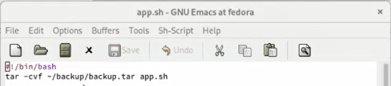
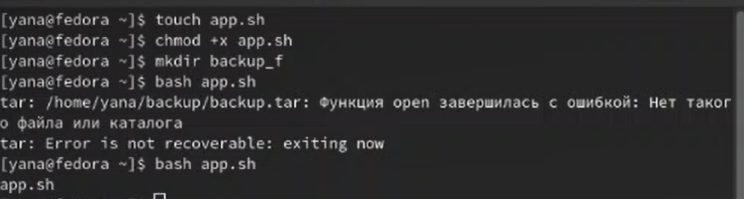
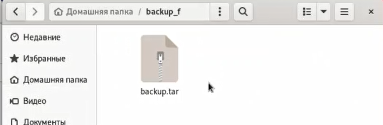
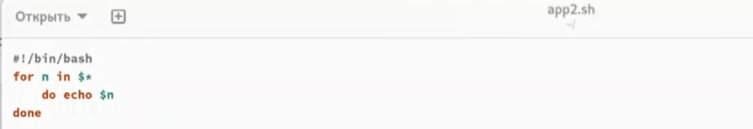
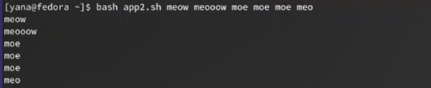
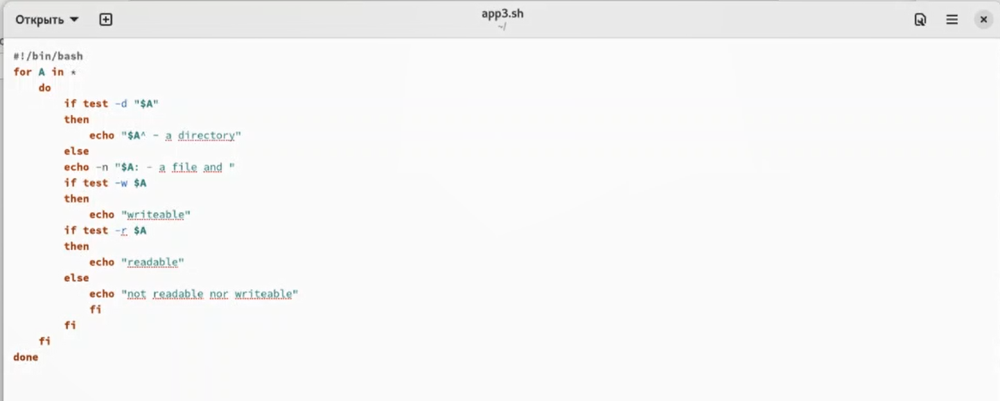
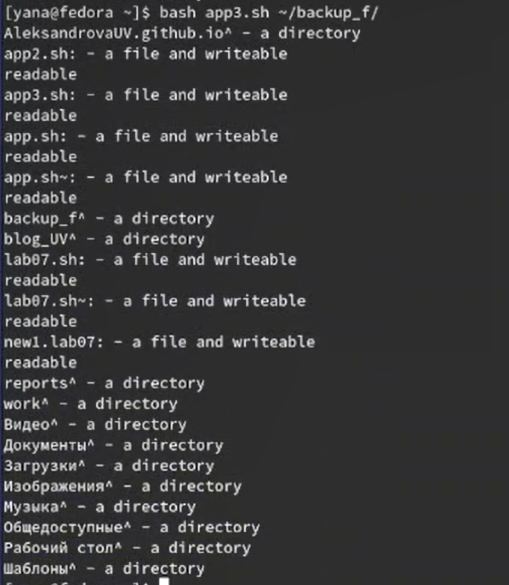
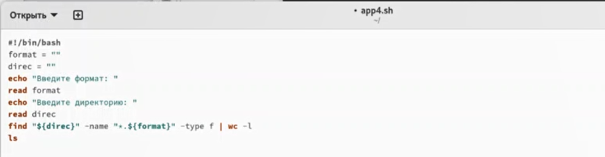
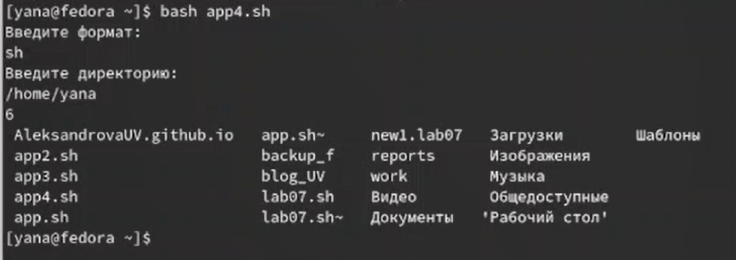

---
## Front matter
lang: ru-RU
title: Лабораторная работа №10
subtitle: Операционные системы
author:
  - Александрова У.В.
institute:
  - Российский университет дружбы народов, Москва, Россия
date: 15 апреля 2023

## i18n babel
babel-lang: russian
babel-otherlangs: english

## Formatting pdf
toc: false
toc-title: Содержание
slide_level: 2
aspectratio: 169
section-titles: true
theme: metropolis
header-includes:
 - \metroset{progressbar=frametitle,sectionpage=progressbar,numbering=fraction}
 - '\makeatletter'
 - '\beamer@ignorenonframefalse'
 - '\makeatother'
---

# Информация

## Докладчик

  * Александрова Ульяна
  * студентка 1-го курса
  * Российский университет дружбы народов
  * <https://github.com/AleksandrovaUV>

# Цель работы

## Цель работы

Изучить основы программирования в оболочке ОС UNIX/Linux. Научиться писать небольшие командные файлы.

# Выполнение лабораторной работы

## Выполнение лабораторной работы

Я создаю файл программы и прописываю в ней необходимый код.

{#fig:001 width=70%}

## Выполнение лабораторной работы

Я запускаю программу и проверяю выполнение. Программа работает (рис. @fig:002).

{#fig:002 width=70%}

{#fig:003 width=70%}

## Выполнение лабораторной работы

Создаю файл для второй программы и также ввожу код.

{#fig:004 width=70%}

## Выполнение лабораторной работы

Проверяю работу командного файла. Все работает.

{#fig:005 width=70%}

## Выполнение лабораторной работы

Создаю третий командный файл, редактирую.

{#fig:006 width=70%}

## Выполнение лабораторной работы

Проверяю работу. Все корректно.

{#fig:007 width=70%}

## Выполнение лабораторной работы

Создаю четвертый файл, заполняю.

{#fig:008 width=70%}

## Выполнение лабораторной работы

Файл работает корректно.

{#fig:009 width=70%}

# Выводы

## Выводы

Я изучила основы программирования в оболочке ОС UNIX/Linux, научилась писать небольшие командные файлы.

