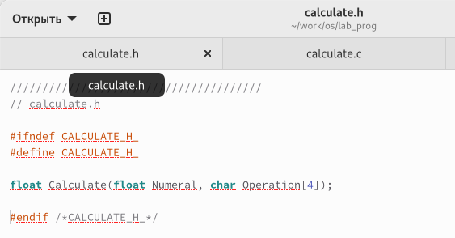
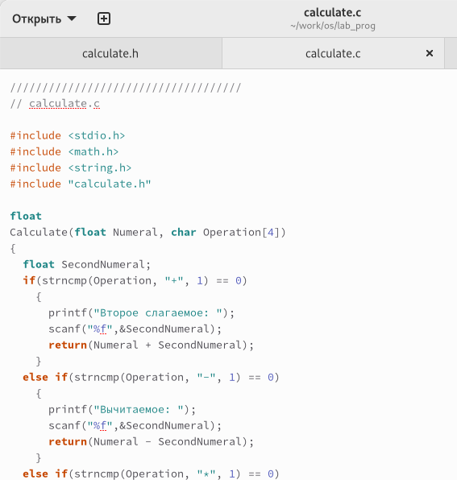
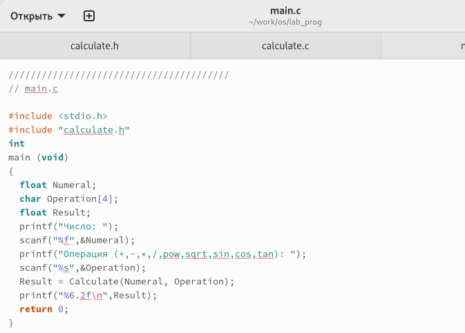
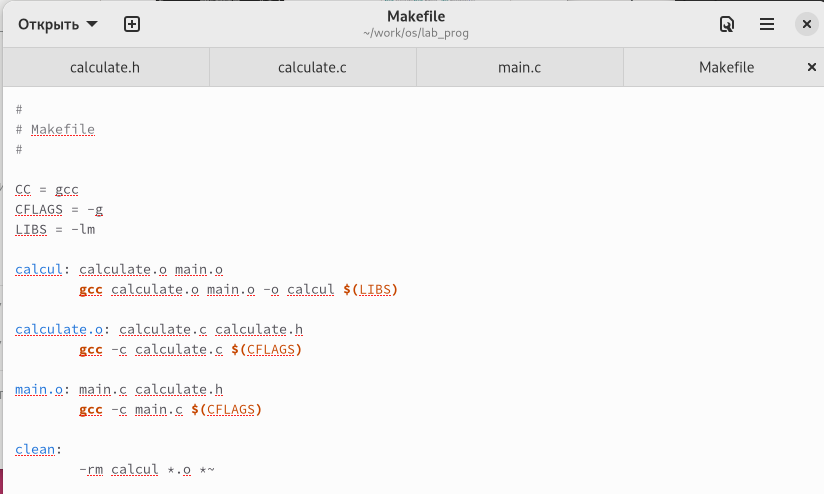
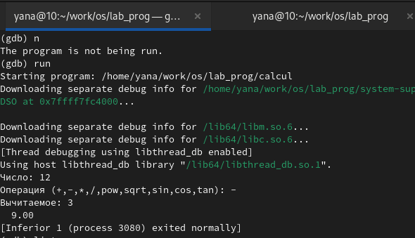

---
## Front matter
title: "Лабораторная работа №14"
subtitle: "Операционные системы"
author: "Александрова Ульяна"

## Generic otions
lang: ru-RU
toc-title: "Содержание"

## Bibliography
bibliography: bib/cite.bib
csl: pandoc/csl/gost-r-7-0-5-2008-numeric.csl

## Pdf output format
toc: true # Table of contents
toc-depth: 2
lof: true # List of figures
lot: true # List of tables
fontsize: 12pt
linestretch: 1.5
papersize: a4
documentclass: scrreprt
## I18n polyglossia
polyglossia-lang:
  name: russian
  options:
	- spelling=modern
	- babelshorthands=true
polyglossia-otherlangs:
  name: english
## I18n babel
babel-lang: russian
babel-otherlangs: english
## Fonts
mainfont: PT Serif
romanfont: PT Serif
sansfont: PT Sans
monofont: PT Mono
mainfontoptions: Ligatures=TeX
romanfontoptions: Ligatures=TeX
sansfontoptions: Ligatures=TeX,Scale=MatchLowercase
monofontoptions: Scale=MatchLowercase,Scale=0.9
## Biblatex
biblatex: true
biblio-style: "gost-numeric"
biblatexoptions:
  - parentracker=true
  - backend=biber
  - hyperref=auto
  - language=auto
  - autolang=other*
  - citestyle=gost-numeric
## Pandoc-crossref LaTeX customization
figureTitle: "Рис."
tableTitle: "Таблица"
listingTitle: "Листинг"
lofTitle: "Список иллюстраций"
lotTitle: "Список таблиц"
lolTitle: "Листинги"
## Misc options
indent: true
header-includes:
  - \usepackage{indentfirst}
  - \usepackage{float} # keep figures where there are in the text
  - \floatplacement{figure}{H} # keep figures where there are in the text
---

# Цель работы

Приобрести простейшие навыки разработки, анализа, тестирования и отладки приложений в ОС типа UNIX/Linux на примере создания на языке программирования
С калькулятора с простейшими функциями.

# Задание

1. В домашнем каталоге создайте подкаталог ~/work/os/lab_prog.
2. Создайте в нём файлы: calculate.h, calculate.c, main.c. Это будет примитивнейший калькулятор, способный складывать, вычитать, умножать и делить, возводить число в степень, брать квадратный корень, вычислять sin, cos, tan. При запуске он будет запрашивать первое число, операцию, второе число. После этого программа выведет результат и остановится.
3. Выполните компиляцию программы посредством gcc.
4. При необходимости исправьте синтаксические ошибки.
5. Создайте Makefile со следующим содержанием.
6. С помощью gdb выполните отладку программы calcul (перед использованием gdb исправьте Makefile).
7. С помощью утилиты splint попробуйте проанализировать коды файлов calculate.c и main.c.

# Теоретическое введение

Процесс разработки программного обеспечения обычно разделяется на следующие
этапы:
- планирование, включающее сбор и анализ требований к функционалу и другим характеристикам разрабатываемого приложения;
- проектирование, включающее в себя разработку базовых алгоритмов и спецификаций, определение языка программирования;
- непосредственная разработка приложения:
- кодирование — по сути создание исходного текста программы (возможно
в нескольких вариантах);
- анализ разработанного кода;
- сборка, компиляция и разработка исполняемого модуля;
- тестирование и отладка, сохранение произведённых изменений;
- документирование.
Для создания исходного текста программы разработчик может воспользоваться любым удобным для него редактором текста: vi, vim, mceditor, emacs, geany и др.
После завершения написания исходного кода программы (возможно состоящей из
нескольких файлов), необходимо её скомпилировать и получить исполняемый модуль.

Стандартным средством для компиляции программ в ОС типа UNIX является GCC (GNU
Compiler Collection). Это набор компиляторов для разного рода языков программирования (С, C++, Java, Фортран и др.). Работа с GCC производится при помощи одноимённой
управляющей программы gcc, которая интерпретирует аргументы командной строки,
определяет и осуществляет запуск нужного компилятора для входного файла.

Во время работы над кодом программы программист неизбежно сталкивается с появлением ошибок в ней. Использование отладчика для поиска и устранения ошибок
в программе существенно облегчает жизнь программиста. В комплект программ GNU для ОС типа UNIX входит отладчик GDB (GNU Debugger).

Ещё одним средством проверки исходных кодов программ, написанных на языке C,
является утилита splint. Эта утилита анализирует программный код, проверяет корректность задания аргументов использованных в программе функций и типов возвращаемых
значений, обнаруживает синтаксические и семантические ошибки.
В отличие от компилятора C анализатор splint генерирует комментарии с описанием
разбора кода программы и осуществляет общий контроль, обнаруживая такие ошибки,
как одинаковые объекты, определённые в разных файлах, или объекты, чьи значения не
используются в работе программы, переменные с некорректно заданными значениями
и типами и многое другое.

# Выполнение лабораторной работы

Создала требуемый репозиторий и файлы, необходимые для выполнения работы (рис. @fig:001).

{#fig:001 width=70%}

Записываю реализацию функций калькулятора сначала в файле calculate.h (рис. @fig:002).

{#fig:002 width=70%}

Затем в calculate.c (рис. @fig:003).

{#fig:003 width=70%}

И в main.c (рис. @fig:004).

{#fig:004 width=70%}

Выполняю компиляцию программы посредством gcc (рис. @fig:005).

{#fig:005 width=70%}

Создаю и заполняю файл Makefile (рис. @fig:006).

{#fig:006 width=70%}

Запустила отладчик gdb, программа работает (рис. @fig:007).

{#fig:007 width=70%}

Для постраничного просмотра исходного код использовала команду list (рис. @fig:008).

{#fig:008 width=70%}

# Выводы

Я приобрела простейшие навыки разработки, анализа, тестирования и отладки приложений в ОС типа UNIX/Linux на примере создания на языке программирования С калькулятора с простейшими функциями.

# Контрольные вопросы

1. Как получить информацию о возможностях программ gcc, make, gdb и др.?

*info, man.*

2. Назовите и дайте краткую характеристику основным этапам разработки приложений в UNIX.

- создание исходного кода программы;
- представляется в виде файла;
- сохранение различных вариантов исходного текста;
- анализ исходного текста;
- компиляция исходного текста и построение исполняемого модуля;
- тестирование и отладка;
- сохранение всех изменений, выполняемых при тестировании и отладке.

3. Что такое суффикс в контексте языка программирования? Приведите примеры использования.

Использование суффикса ".с" для имени файла с программой на языке Си отражает удобное и полезное соглашение, принятое в ОС UNIX. Для любого имени входного файла суффикс определяет какая компиляция требуется. Суффиксы и префиксы указывают тип объекта.

4. Каково основное назначение компилятора языка С в UNIX?

Основное назначение компилятора с языка Си заключается в компиляции всей программы в целом.

5. Для чего предназначена утилита make?

Программа make служит для документирования взаимосвязей между файлами. Описание взаимосвязей и соответствующих действий хранится в так называемом make-файле, который по умолчанию имеет имя makefile или Makefile.

6. Приведите пример структуры Makefile. Дайте характеристику основным элементам этого файла.
7. Назовите основное свойство, присущее всем программам отладки. Что необходимо сделать, чтобы его можно было использовать?
8. Назовите и дайте основную характеристику основным командам отладчика gdb.
9. Опишите по шагам схему отладки программы, которую Вы использовали при выполнении лабораторной работы.
10. Прокомментируйте реакцию компилятора на синтаксические ошибки в программе при его первом запуске.
11. Назовите основные средства, повышающие понимание исходного кода программы.
12. Каковы основные задачи, решаемые программой splint

