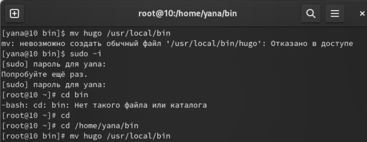
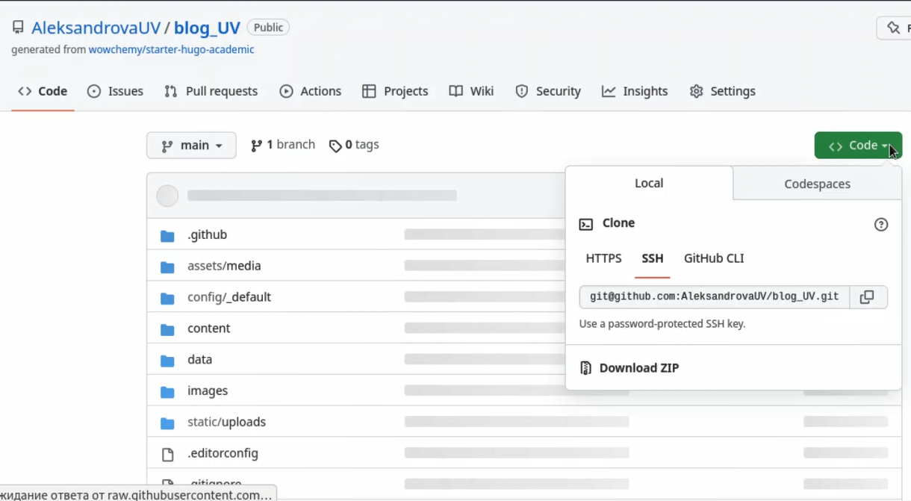
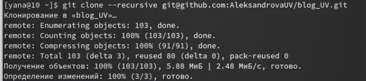
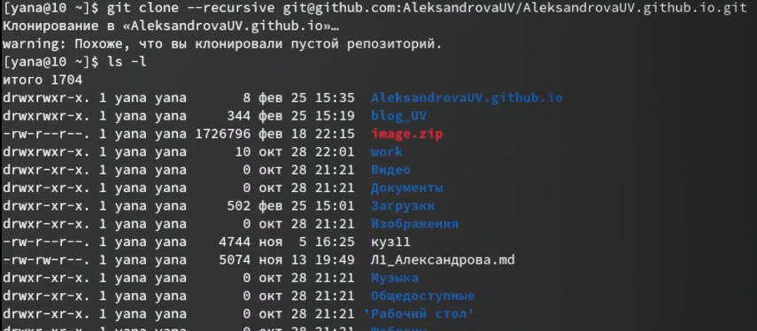
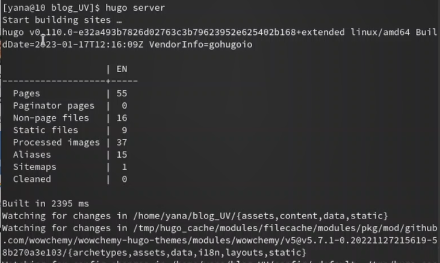
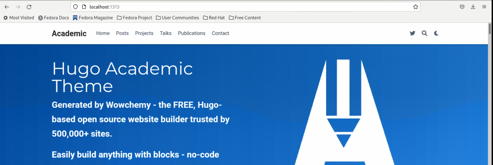
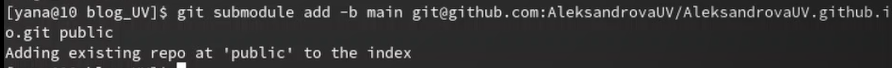
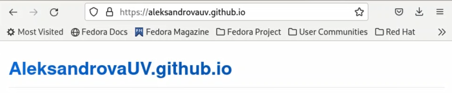

---
## Front matter
lang: ru-RU
title: Отчет. Этап 1
subtitle: Операционные системы
author:
  - Александрова У.В.
institute:
  - Российский университет дружбы народов, Москва, Россия

## i18n babel
babel-lang: russian
babel-otherlangs: english

## Formatting pdf
toc: false
toc-title: Содержание
slide_level: 2
aspectratio: 169
section-titles: true
theme: metropolis
header-includes:
 - \metroset{progressbar=frametitle,sectionpage=progressbar,numbering=fraction}
 - '\makeatletter'
 - '\beamer@ignorenonframefalse'
 - '\makeatother'
---

## Цель работы

Целью данной работы является размещение на Github pages заготовки для персонального сайта.

## Задание

- Установить необходимое программное обеспечение.
- Скачать шаблон темы сайта.
- Разместить его на хостинге git.
- Установить параметр для URLs сайта.
- Разместить заготовку сайта на Github pages.

## Установка ПО

{ width=70% }

## Создание репозитория

{ width=70% }

##Создание репозитория

{ width=70% }

## Установка необходимого ПО

Подмонтирование диска дополнений гостевой ОС.

{#fig:004 width=60%}

## Подключение сервера

{ width=70% }

## Подключение сервера

{ width=70% }

## Подключение сервера

{ width=70% }

## Подключение сервера

{ width=70% }

## Подключение сервера

{ width=70% }

## Вывод

Я приобрела практические навыки установки ОС на виртуальную машину VirtualBox и настройки сервисов, необходимых для дальнейшей работы.

:::

