---
## Front matter
title: "Отчет по проекту №1"
subtitle: "Операционная система"
author: "Александрова Ульяна Вадимовна"

## Generic otions
lang: ru-RU
toc-title: "Содержание"

## Bibliography
bibliography: bib/cite.bib
csl: pandoc/csl/gost-r-7-0-5-2008-numeric.csl

## Pdf output format
toc: true # Table of contents
toc-depth: 2
lof: true # List of figures
lot: true # List of tables
fontsize: 12pt
linestretch: 1.5
papersize: a4
documentclass: scrreprt
## I18n polyglossia
polyglossia-lang:
  name: russian
  options:
	- spelling=modern
	- babelshorthands=true
polyglossia-otherlangs:
  name: english
## I18n babel
babel-lang: russian
babel-otherlangs: english
## Fonts
mainfont: PT Serif
romanfont: PT Serif
sansfont: PT Sans
monofont: PT Mono
mainfontoptions: Ligatures=TeX
romanfontoptions: Ligatures=TeX
sansfontoptions: Ligatures=TeX,Scale=MatchLowercase
monofontoptions: Scale=MatchLowercase,Scale=0.9
## Biblatex
biblatex: true
biblio-style: "gost-numeric"
biblatexoptions:
  - parentracker=true
  - backend=biber
  - hyperref=auto
  - language=auto
  - autolang=other*
  - citestyle=gost-numeric
## Pandoc-crossref LaTeX customization
figureTitle: "Рис."
tableTitle: "Таблица"
listingTitle: "Листинг"
lofTitle: "Список иллюстраций"
lotTitle: "Список таблиц"
lolTitle: "Листинги"
## Misc options
indent: true
header-includes:
  - \usepackage{indentfirst}
  - \usepackage{float} # keep figures where there are in the text
  - \floatplacement{figure}{H} # keep figures where there are in the text
---

# Цель работы

Размещение на Github pages заготовки для персонального сайта.

# Задание

- Установить необходимое программное обеспечение.
- Скачать шаблон темы сайта.
- Разместить его на хостинге git.
- Установить параметр для URLs сайта.
- Разместить заготовку сайта на Github pages.

# Выполнение лабораторной работы

Я загружаю пакет файлов из предложенного репозитория и перемещаю файл hugo в каталог /usr/local/bin для упрощения работы с приложением (рис. [-@fig:001]).

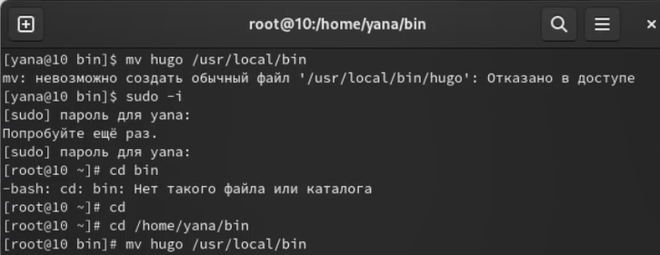{ #fig:001 width=70% }

Далее я добавляю к себе репозиторий из шаблона на GitHub (рис. [-@fig:002]).

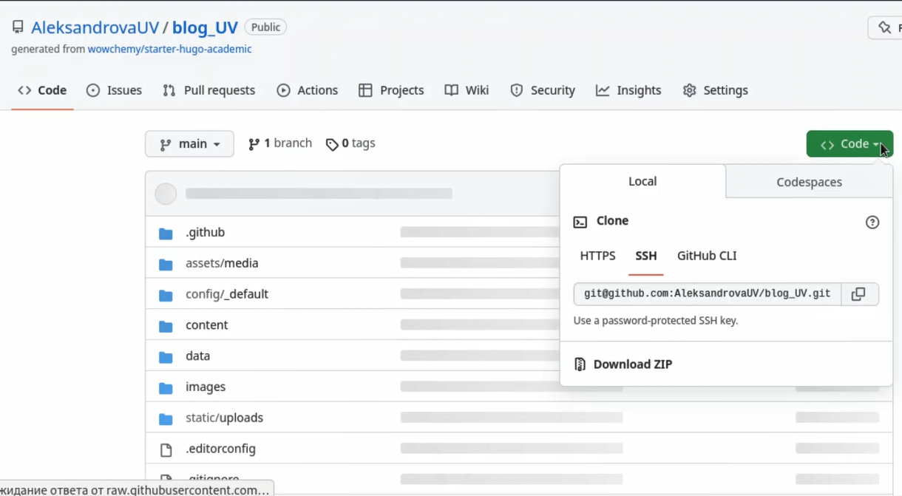{ #fig:002 width=70% }

Копирую репозиторий в созданную папку (рис. [-@fig:003]) и запускаю программу (рис. [-@fig:004]).

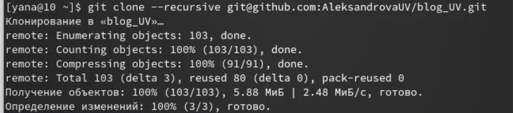{ #fig:003 width=70% }

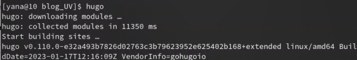{ #fig:004 width=70% }

Я удаляю каталог "public", чтобы с ним не было проблем в будущем (рис. [-@fig:005]).

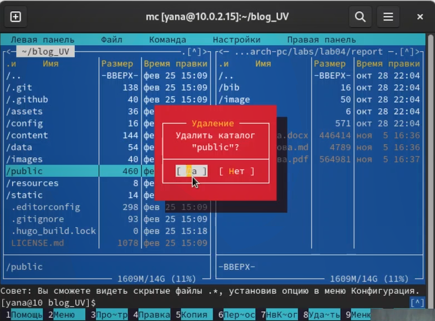{ #fig:005 width=70% }

Далее запускаю hugo server (рис. [-@fig:006]) и открываю локальный сайт (рис. [-@fig:007]).

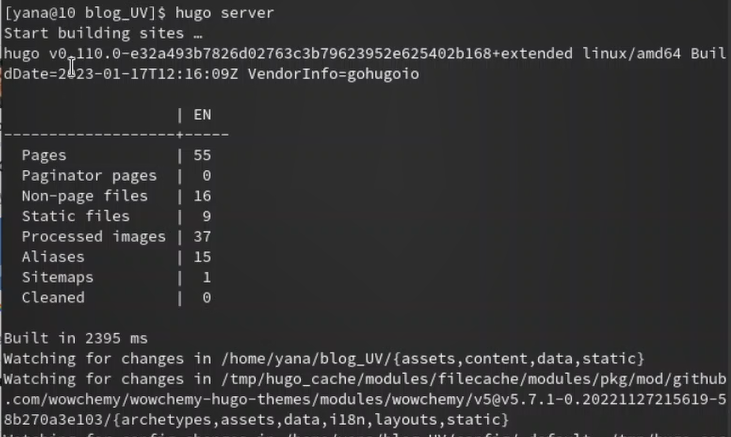{ #fig:006 width=70% }

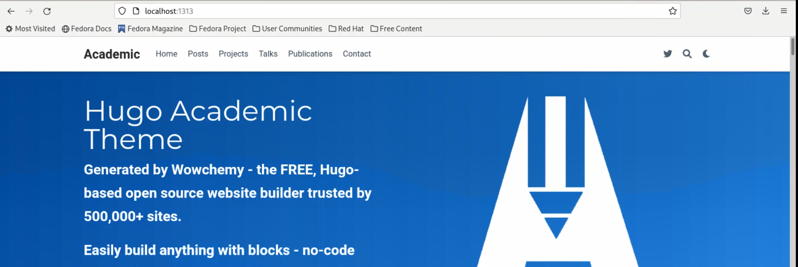{ #fig:007 width=70% }

Создаю новый репозиторий через сайт GitHub и называю его "AleksandrovaUV.github.io" и клонирую его (рис. [-@fig:008]).

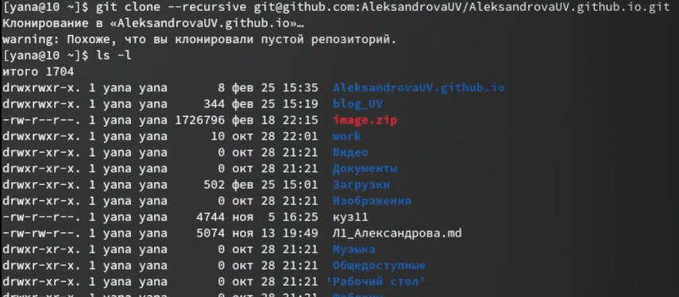{ #fig:008 width=70% }

Перехожу в созданный каталог и переключаюсь на главную ветку, а также создаю файл "README.md" (рис. [-@fig:009]), (рис. [-@fig:010]).

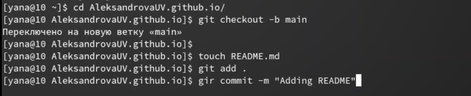{ #fig:009 width=70% }

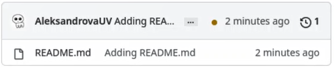{ #fig:010 width=70% }

Подключаю созданный репозиторий к папке "public", но так как программа ее игнорирует, я комментирую строчку "public" в файле .gitignore (рис. [-@fig:011]), (рис. [-@fig:012]).

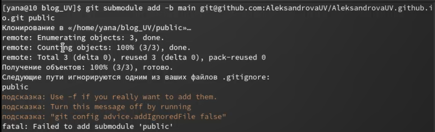{ #fig:011 width=70% }

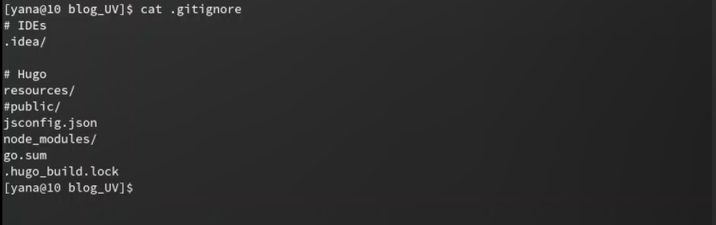{ #fig:012 width=70% }

Повторяю команду (рис. [-@fig:013]).

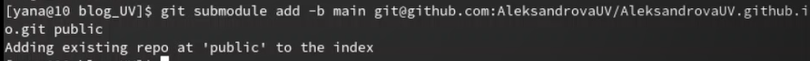{ #fig:013 width=70% }

Сайт доступен (рис. [-@fig:014]).

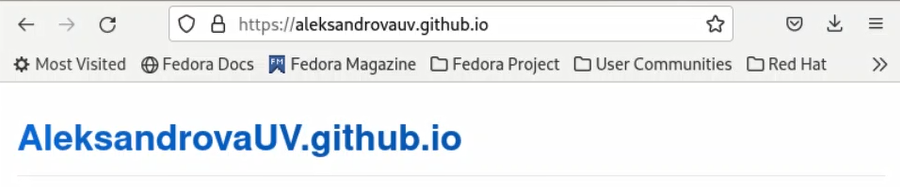{ #fig:014 width=70% }

# Выводы

Я разместила заготовку для персонального сайта на Github pages. 

:::
