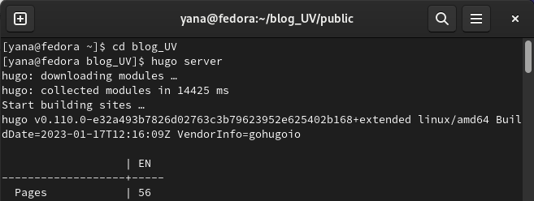
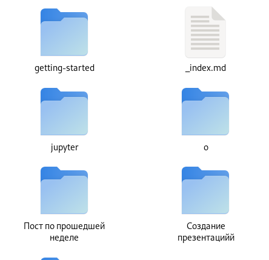
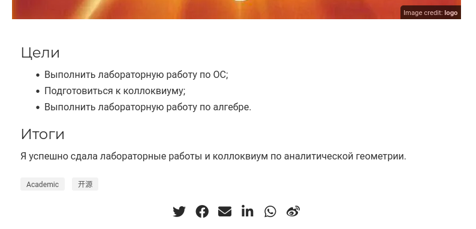
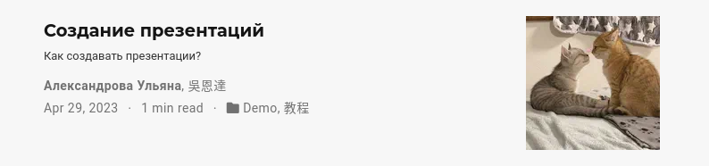
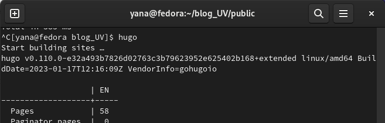
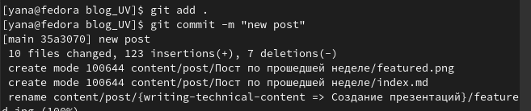

---
## Front matter
lang: ru-RU
title: Персоналный проект. Этап 4
subtitle: Операционные системы
author:
  - Александрова Ульяна 
institute:
  - Российский университет дружбы народов, Москва, Россия
date: 09 апреля 2023

## i18n babel
babel-lang: russian
babel-otherlangs: english

## Formatting pdf
toc: false
toc-title: Содержание
slide_level: 2
aspectratio: 169
section-titles: true
theme: metropolis
header-includes:
 - \metroset{progressbar=frametitle,sectionpage=progressbar,numbering=fraction}
 - '\makeatletter'
 - '\beamer@ignorenonframefalse'
 - '\makeatother'
---

# Информация

## Докладчик

  * Александрова Ульяна
  * студентка 1-го курса
  * Российский университет дружбы народов
  * <https://github.com/AleksandrovaUV>

# Цель работы

## Цель работы

Изменить данные в шаблоне персонального сайта.

# Задание

## Задание

- Добавить к сайту ссылки на научные и библиометрические ресурсы;
- Сделать тест по прошедшей неделе;
- Добавить пост на тему по выбору.

# Выполнение лабораторной работы

## Выполнение лабораторной работы

Открываю локальный сервер.

{#fig:001 width=70%}

## Выполнение лабораторной работы

Вношу изменения. Добавляю следующие ссылки:

- eLIBRARY: <https://elibrary.ru/project_user_office.asp>
- ORCID: <https://orcid.org/0009-0009-1910-0590>
- ResearchGate: <https://www.researchgate.net/profile/Uliana-Aleksandrova>
- Academia: <https://independent.academia.edu/%D0%A3%D0%BB%D1%8C%D1%8F%D0%BD%D0%B0%D0%90%D0%BB%D0%B5%D0%BA%D1%81%D0%B0%D0%BD%D0%B4%D1%80%D0%BE%D0%B2%D0%B01>
- Github: <https://github.com/AleksandrovaUV>

## Выполнение лабораторной работы

Добавляю необходимые посты, требуемые по заданию.

{#fig:003 width=70%}

## Выполнение лабораторной работы

{#fig:004 width=70%}

{#fig:005 width=70%}

## Выполнение лабораторной работы

Сохраняю изменения и загружаю их в облако.

{#fig:006 width=70%}

## Выполнение лабораторной работы

Загружаю изменения на гит.

{#fig:007 width=70%}

# Выводы

## Выводы

Я научилась обновлять ссылки на ресурсы.

:::
