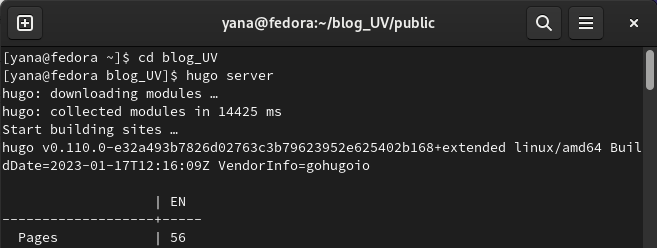
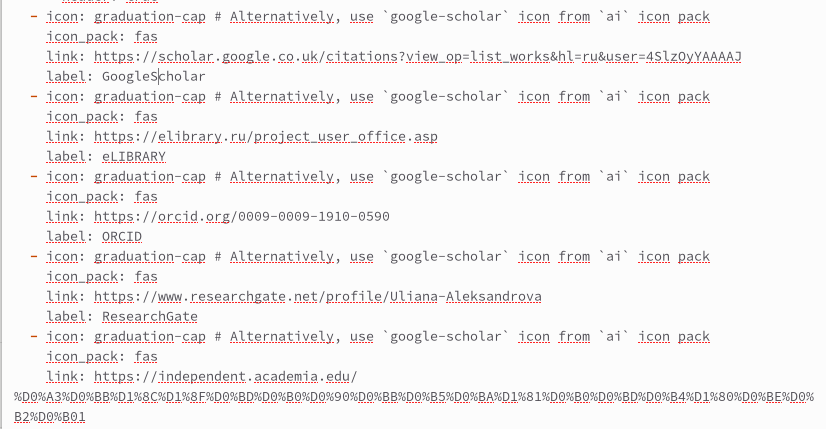
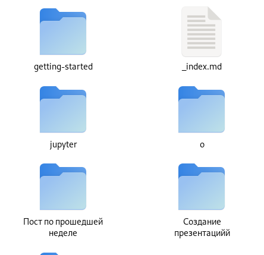
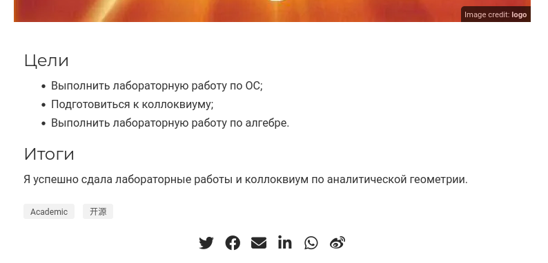
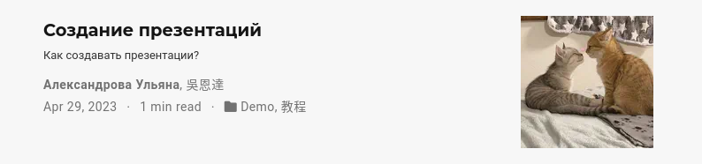
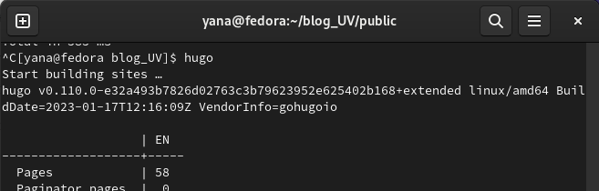
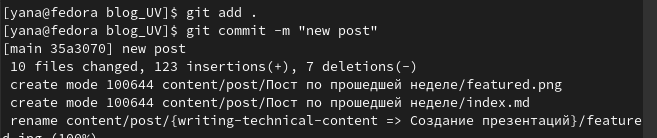

---
## Front matter
title: "Персональный проект. Этап 4"
subtitle: Операционные системы"
author: "Александрова Ульяна"

## Generic otions
lang: ru-RU
toc-title: "Содержание"

## Bibliography
bibliography: bib/cite.bib
csl: pandoc/csl/gost-r-7-0-5-2008-numeric.csl

## Pdf output format
toc: true # Table of contents
toc-depth: 2
lof: true # List of figures
lot: true # List of tables
fontsize: 12pt
linestretch: 1.5
papersize: a4
documentclass: scrreprt
## I18n polyglossia
polyglossia-lang:
  name: russian
  options:
	- spelling=modern
	- babelshorthands=true
polyglossia-otherlangs:
  name: english
## I18n babel
babel-lang: russian
babel-otherlangs: english
## Fonts
mainfont: PT Serif
romanfont: PT Serif
sansfont: PT Sans
monofont: PT Mono
mainfontoptions: Ligatures=TeX
romanfontoptions: Ligatures=TeX
sansfontoptions: Ligatures=TeX,Scale=MatchLowercase
monofontoptions: Scale=MatchLowercase,Scale=0.9
## Biblatex
biblatex: true
biblio-style: "gost-numeric"
biblatexoptions:
  - parentracker=true
  - backend=biber
  - hyperref=auto
  - language=auto
  - autolang=other*
  - citestyle=gost-numeric
## Pandoc-crossref LaTeX customization
figureTitle: "Рис."
tableTitle: "Таблица"
listingTitle: "Листинг"
lofTitle: "Список иллюстраций"
lotTitle: "Список таблиц"
lolTitle: "Листинги"
## Misc options
indent: true
header-includes:
  - \usepackage{indentfirst}
  - \usepackage{float} # keep figures where there are in the text
  - \floatplacement{figure}{H} # keep figures where there are in the text
---

# Цель работы

Изменить данные в шаблоне персонального сайта.

# Задание

- Добавить к сайту ссылки на научные и библиометрические ресурсы;
- Сделать тест по прошедшей неделе;
- Добавить пост на тему по выбору.

# Выполнение лабораторной работы

Открываю локальный сервер (рис. @fig:001).

{#fig:001 width=70%}

Вношу изменения. Добавляю следующие ссылки: (рис. @fig:002)

- eLIBRARY: <https://elibrary.ru/project_user_office.asp>
- ORCID: <https://orcid.org/0009-0009-1910-0590>
- ResearchGate: <https://www.researchgate.net/profile/Uliana-Aleksandrova>
- Academia: <https://independent.academia.edu/%D0%A3%D0%BB%D1%8C%D1%8F%D0%BD%D0%B0%D0%90%D0%BB%D0%B5%D0%BA%D1%81%D0%B0%D0%BD%D0%B4%D1%80%D0%BE%D0%B2%D0%B01>
- Github: <https://github.com/AleksandrovaUV>

{#fig:002 width=70%}

Добавляю необходимые посты, требуемые по заданию (рис. @fig:003), (рис. @fig:004),  (рис. @fig:005).

{#fig:003 width=70%}

{#fig:004 width=70%}

{#fig:005 width=70%}

Сохраняю изменения и загружаю их в облако (рис. @fig:006).

{#fig:006 width=70%}

Загружаю изменения на гит (рис. @fig:007).

{#fig:007 width=70%}

# Выводы

Я научилась обновлять ссылки на ресурсы.

:::
